<!-- GENERATED:MODEL -->
---
tags: [odoo, community, generated, model]
---

# mail.followers.edit

- Module: [[docs/Community Addons/mail/mail|mail]]
- Scope: Community Addons
- Defined in module: yes
- Source files: `wizard/mail_followers_edit.py`
- Python classes: `MailFollowersEdit`
- Description: Followers edit wizard

## Field footprint

- Detected fields: 6
- Field types: `Boolean` x 1, `Char` x 2, `Html` x 1, `Many2many` x 1, `Selection` x 1
- Relation fields: 1

## Sample fields

- `message`: `Html` (comodel `Message`)
- `notify`: `Boolean` (comodel `Notify Recipients`)
- `operation`: `Selection`
- `partner_ids`: `Many2many` (comodel `res.partner`)
- `res_ids`: `Char` (comodel `Related Document IDs`)
- `res_model`: `Char` (comodel `Related Document Model`)

## Method hints

- Detected methods: 2
- Action methods: none
- Compute methods: none
- Onchange methods: none

## Direct relation diagram

```plantuml
@startuml
!define ODOO_COLOR_PRIMARY #714B67
!define ODOO_COLOR_ACCENT #875A7B
!define ODOO_COLOR_BG #FAF7FA

skinparam backgroundColor ODOO_COLOR_BG
skinparam defaultTextAlignment left
skinparam ArrowColor ODOO_COLOR_ACCENT
skinparam ClassBackgroundColor white
skinparam ClassBorderColor ODOO_COLOR_PRIMARY
skinparam ComponentBackgroundColor white
skinparam ComponentBorderColor ODOO_COLOR_PRIMARY
skinparam NoteBackgroundColor #FFF8FF
skinparam NoteBorderColor ODOO_COLOR_ACCENT
skinparam SequenceLifeLineBorderColor ODOO_COLOR_ACCENT
skinparam SequenceLifeLineBackgroundColor #FFFFFF
skinparam SequenceParticipantBorderColor ODOO_COLOR_PRIMARY
skinparam SequenceParticipantBackgroundColor #FFFFFF
skinparam sequence {
  ArrowColor ODOO_COLOR_ACCENT
  ActorBorderColor ODOO_COLOR_PRIMARY
}
title mail.followers.edit - Direct Relations
class "mail.followers.edit" as mail_followers_edit
class "res.partner" as res_partner
mail_followers_edit .. res_partner : partner_ids
@enduml
```

## Navigation

- **Parent:** [[docs/Community Addons/mail/Models]]

<!-- GENERATED:MODEL -->
