<!-- GENERATED:MODEL -->
---
tags: [odoo, community, generated, model]
---

# mail.followers

- Module: [[docs/Community Addons/mail/mail|mail]]
- Scope: Community Addons
- Defined in module: yes
- Source files: `models/mail_followers.py`
- Python classes: `MailFollowers`
- Description: Document Followers

## Field footprint

- Detected fields: 7
- Field types: `Boolean` x 1, `Char` x 3, `Many2many` x 1, `Many2one` x 1, `Many2oneReference` x 1
- Relation fields: 2

## Sample fields

- `email`: `Char` (comodel `Email`, related `partner_id.email`)
- `is_active`: `Boolean` (comodel `Is Active`, related `partner_id.active`)
- `name`: `Char` (comodel `Name`, related `partner_id.name`)
- `partner_id`: `Many2one` (comodel `res.partner`)
- `res_id`: `Many2oneReference` (comodel `Related Document ID`)
- `res_model`: `Char` (comodel `Related Document Model Name`)
- `subtype_ids`: `Many2many` (comodel `mail.message.subtype`)

## Method hints

- Detected methods: 12
- Action methods: none
- Compute methods: `_compute_display_name`
- Onchange methods: none

## Direct relation diagram

```plantuml
@startuml
!define ODOO_COLOR_PRIMARY #714B67
!define ODOO_COLOR_ACCENT #875A7B
!define ODOO_COLOR_BG #FAF7FA

skinparam backgroundColor ODOO_COLOR_BG
skinparam defaultTextAlignment left
skinparam ArrowColor ODOO_COLOR_ACCENT
skinparam ClassBackgroundColor white
skinparam ClassBorderColor ODOO_COLOR_PRIMARY
skinparam ComponentBackgroundColor white
skinparam ComponentBorderColor ODOO_COLOR_PRIMARY
skinparam NoteBackgroundColor #FFF8FF
skinparam NoteBorderColor ODOO_COLOR_ACCENT
skinparam SequenceLifeLineBorderColor ODOO_COLOR_ACCENT
skinparam SequenceLifeLineBackgroundColor #FFFFFF
skinparam SequenceParticipantBorderColor ODOO_COLOR_PRIMARY
skinparam SequenceParticipantBackgroundColor #FFFFFF
skinparam sequence {
  ArrowColor ODOO_COLOR_ACCENT
  ActorBorderColor ODOO_COLOR_PRIMARY
}
title mail.followers - Direct Relations
class "mail.followers" as mail_followers
class "mail.message.subtype" as mail_message_subtype
class "res.partner" as res_partner
mail_followers --> res_partner : partner_id
mail_followers .. mail_message_subtype : subtype_ids
@enduml
```

## Navigation

- **Parent:** [[docs/Community Addons/mail/Models]]

<!-- GENERATED:MODEL -->
