<!-- GENERATED:MODEL -->
---
tags: [odoo, community, generated, model]
---

# mail.guest

- Module: [[docs/Community Addons/mail/mail|mail]]
- Scope: Community Addons
- Defined in module: yes
- Source files: `models/discuss/mail_guest.py`
- Python classes: `MailGuest`
- Description: Guest
- Inherits: `avatar.mixin`, `bus.listener.mixin`

## Field footprint

- Detected fields: 10
- Field types: `Char` x 4, `Datetime` x 1, `Many2many` x 1, `Many2one` x 1, `One2many` x 1, `Selection` x 2
- Relation fields: 3

## Sample fields

- `access_token`: `Char`
- `channel_ids`: `Many2many` (comodel `discuss.channel`)
- `country_id`: `Many2one` (comodel `res.country`)
- `email`: `Char`
- `im_status`: `Char` (comodel `IM Status`, compute `_compute_im_status`)
- `lang`: `Selection`
- `name`: `Char`
- `offline_since`: `Datetime` (comodel `Offline since`, compute `_compute_im_status`)
- `presence_ids`: `One2many` (comodel `mail.presence`)
- `timezone`: `Selection`

## Method hints

- Detected methods: 13
- Action methods: none
- Compute methods: `_compute_im_status`
- Onchange methods: none

## Direct relation diagram

```plantuml
@startuml
!define ODOO_COLOR_PRIMARY #714B67
!define ODOO_COLOR_ACCENT #875A7B
!define ODOO_COLOR_BG #FAF7FA

skinparam backgroundColor ODOO_COLOR_BG
skinparam defaultTextAlignment left
skinparam ArrowColor ODOO_COLOR_ACCENT
skinparam ClassBackgroundColor white
skinparam ClassBorderColor ODOO_COLOR_PRIMARY
skinparam ComponentBackgroundColor white
skinparam ComponentBorderColor ODOO_COLOR_PRIMARY
skinparam NoteBackgroundColor #FFF8FF
skinparam NoteBorderColor ODOO_COLOR_ACCENT
skinparam SequenceLifeLineBorderColor ODOO_COLOR_ACCENT
skinparam SequenceLifeLineBackgroundColor #FFFFFF
skinparam SequenceParticipantBorderColor ODOO_COLOR_PRIMARY
skinparam SequenceParticipantBackgroundColor #FFFFFF
skinparam sequence {
  ArrowColor ODOO_COLOR_ACCENT
  ActorBorderColor ODOO_COLOR_PRIMARY
}
title mail.guest - Direct Relations
class "mail.guest" as mail_guest
class "discuss.channel" as discuss_channel
class "mail.presence" as mail_presence
class "res.country" as res_country
mail_guest --> res_country : country_id
mail_guest .. discuss_channel : channel_ids
mail_guest --|> mail_presence : presence_ids
@enduml
```

## Navigation

- **Parent:** [[docs/Community Addons/mail/Models]]

<!-- GENERATED:MODEL -->
