<!-- GENERATED:MODEL -->
---
tags: [odoo, community, generated, model]
---

# mail.link.preview

- Module: [[docs/Community Addons/mail/mail|mail]]
- Scope: Community Addons
- Defined in module: yes
- Source files: `models/mail_link_preview.py`
- Python classes: `MailLinkPreview`
- Description: Store link preview data
- Inherits: `bus.listener.mixin`

## Field footprint

- Detected fields: 10
- Field types: `Char` x 7, `Datetime` x 1, `One2many` x 1, `Text` x 1
- Relation fields: 1

## Sample fields

- `create_date`: `Datetime`
- `image_mimetype`: `Char` (comodel `Image MIME type`)
- `message_link_preview_ids`: `One2many` (comodel `mail.message.link.preview`)
- `og_description`: `Text` (comodel `Description`)
- `og_image`: `Char` (comodel `Image`)
- `og_mimetype`: `Char` (comodel `MIME type`)
- `og_site_name`: `Char` (comodel `Site name`)
- `og_title`: `Char` (comodel `Title`)
- `og_type`: `Char` (comodel `Type`)
- `source_url`: `Char` (comodel `URL`)

## Method hints

- Detected methods: 5
- Action methods: none
- Compute methods: none
- Onchange methods: none

## Direct relation diagram

```plantuml
@startuml
!define ODOO_COLOR_PRIMARY #714B67
!define ODOO_COLOR_ACCENT #875A7B
!define ODOO_COLOR_BG #FAF7FA

skinparam backgroundColor ODOO_COLOR_BG
skinparam defaultTextAlignment left
skinparam ArrowColor ODOO_COLOR_ACCENT
skinparam ClassBackgroundColor white
skinparam ClassBorderColor ODOO_COLOR_PRIMARY
skinparam ComponentBackgroundColor white
skinparam ComponentBorderColor ODOO_COLOR_PRIMARY
skinparam NoteBackgroundColor #FFF8FF
skinparam NoteBorderColor ODOO_COLOR_ACCENT
skinparam SequenceLifeLineBorderColor ODOO_COLOR_ACCENT
skinparam SequenceLifeLineBackgroundColor #FFFFFF
skinparam SequenceParticipantBorderColor ODOO_COLOR_PRIMARY
skinparam SequenceParticipantBackgroundColor #FFFFFF
skinparam sequence {
  ArrowColor ODOO_COLOR_ACCENT
  ActorBorderColor ODOO_COLOR_PRIMARY
}
title mail.link.preview - Direct Relations
class "mail.link.preview" as mail_link_preview
class "mail.message.link.preview" as mail_message_link_preview
mail_link_preview --|> mail_message_link_preview : message_link_preview_ids
@enduml
```

## Navigation

- **Parent:** [[docs/Community Addons/mail/Models]]

<!-- GENERATED:MODEL -->
