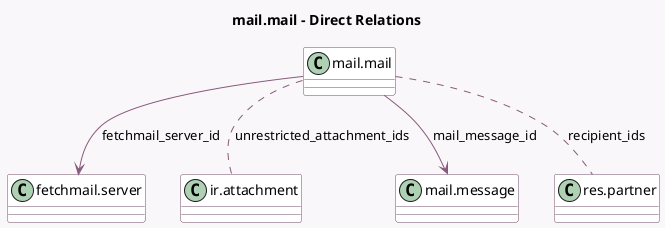

<!-- GENERATED:MODEL -->
---
tags: [odoo, community, generated, model]
---

# mail.mail

- Module: [[docs/Community Addons/mail/mail|mail]]
- Scope: Community Addons
- Defined in module: yes
- Source files: `models/mail_mail.py`
- Python classes: `MailMail`
- Description: Outgoing Mails

## Field footprint

- Detected fields: 19
- Field types: `Boolean` x 2, `Char` x 1, `Datetime` x 1, `Html` x 1, `Integer` x 2, `Many2many` x 2, `Many2one` x 2, `Selection` x 3, `Text` x 5
- Relation fields: 4

## Sample fields

- `auto_delete`: `Boolean` (comodel `Auto Delete`)
- `body_content`: `Html` (comodel `Rich-text Contents`, compute `_compute_body_content`)
- `body_html`: `Text` (comodel `Text Contents`)
- `email_cc`: `Char` (comodel `Cc`)
- `email_to`: `Text` (comodel `To`)
- `failure_reason`: `Text` (comodel `Failure Reason`)
- `failure_type`: `Selection`
- `fetchmail_server_id`: `Many2one` (comodel `fetchmail.server`)
- `headers`: `Text` (comodel `Headers`)
- `is_notification`: `Boolean` (comodel `Notification Email`)
- `mail_message_id`: `Many2one` (comodel `mail.message`)
- `mail_message_id_int`: `Integer` (compute `_compute_mail_message_id_int`)
- `message_type`: `Selection` (related `mail_message_id.message_type`)
- `recipient_ids`: `Many2many` (comodel `res.partner`)
- `references`: `Text` (comodel `References`)
- `restricted_attachment_count`: `Integer` (comodel `Restricted attachments`, compute `_compute_restricted_attachments`)
- `scheduled_date`: `Datetime` (comodel `Scheduled Send Date`)
- `state`: `Selection`
- `unrestricted_attachment_ids`: `Many2many` (comodel `ir.attachment`, compute `_compute_restricted_attachments`)

## Method hints

- Detected methods: 30
- Action methods: `action_open_document`, `action_retry`, `action_send_and_close`
- Compute methods: `_compute_body_content`, `_compute_mail_message_id_int`, `_compute_restricted_attachments`
- Onchange methods: none

## Direct relation diagram

## Navigation

- **Parent:** [[docs/Community Addons/mail/Models]]

<!-- GENERATED:MODEL -->
