<!-- GENERATED:MODEL -->
---
tags: [odoo, community, generated, model]
---

# mail.message.link.preview

- Module: [[docs/Community Addons/mail/mail|mail]]
- Scope: Community Addons
- Defined in module: yes
- Source files: `models/mail_message_link_preview.py`
- Python classes: `MessageMailLinkPreview`
- Description: Link between link previews and messages
- Inherits: `bus.listener.mixin`

## Field footprint

- Detected fields: 5
- Field types: `Boolean` x 1, `Integer` x 1, `Many2one` x 3
- Relation fields: 3

## Sample fields

- `author_id`: `Many2one` (related `message_id.author_id`)
- `is_hidden`: `Boolean`
- `link_preview_id`: `Many2one` (comodel `mail.link.preview`)
- `message_id`: `Many2one` (comodel `mail.message`)
- `sequence`: `Integer` (comodel `Sequence`)

## Method hints

- Detected methods: 4
- Action methods: none
- Compute methods: none
- Onchange methods: none

## Direct relation diagram

```plantuml
@startuml
!define ODOO_COLOR_PRIMARY #714B67
!define ODOO_COLOR_ACCENT #875A7B
!define ODOO_COLOR_BG #FAF7FA

skinparam backgroundColor ODOO_COLOR_BG
skinparam defaultTextAlignment left
skinparam ArrowColor ODOO_COLOR_ACCENT
skinparam ClassBackgroundColor white
skinparam ClassBorderColor ODOO_COLOR_PRIMARY
skinparam ComponentBackgroundColor white
skinparam ComponentBorderColor ODOO_COLOR_PRIMARY
skinparam NoteBackgroundColor #FFF8FF
skinparam NoteBorderColor ODOO_COLOR_ACCENT
skinparam SequenceLifeLineBorderColor ODOO_COLOR_ACCENT
skinparam SequenceLifeLineBackgroundColor #FFFFFF
skinparam SequenceParticipantBorderColor ODOO_COLOR_PRIMARY
skinparam SequenceParticipantBackgroundColor #FFFFFF
skinparam sequence {
  ArrowColor ODOO_COLOR_ACCENT
  ActorBorderColor ODOO_COLOR_PRIMARY
}
title mail.message.link.preview - Direct Relations
class "mail.message.link.preview" as mail_message_link_preview
class "mail.link.preview" as mail_link_preview
class "mail.message" as mail_message
mail_message_link_preview --> mail_message : message_id
mail_message_link_preview --> mail_link_preview : link_preview_id
@enduml
```

## Navigation

- **Parent:** [[docs/Community Addons/mail/Models]]

<!-- GENERATED:MODEL -->
