<!-- GENERATED:MODEL -->
---
tags: [odoo, community, generated, model]
---

# mail.message

- Module: [[docs/Community Addons/mail/mail|mail]]
- Scope: Community Addons
- Defined in module: yes
- Source files: `models/discuss/mail_message.py`, `models/mail_message.py`
- Python classes: `MailMessage`
- Description: Message
- Inherits: `bus.listener.mixin`

## Field footprint

- Detected fields: 45
- Field types: `Binary` x 1, `Boolean` x 7, `Char` x 10, `Datetime` x 2, `Html` x 1, `Many2many` x 5, `Many2one` x 9, `Many2oneReference` x 1, `One2many` x 7, `Selection` x 1, `Text` x 1
- Relation fields: 21

## Sample fields

- `attachment_ids`: `Many2many` (comodel `ir.attachment`)
- `author_avatar`: `Binary` (comodel `Author's avatar`, related `author_id.avatar_128`)
- `author_guest_id`: `Many2one` (comodel `mail.guest`)
- `author_id`: `Many2one` (comodel `res.partner`)
- `body`: `Html` (comodel `Contents`)
- `call_history_ids`: `One2many` (comodel `discuss.call.history`)
- `channel_id`: `Many2one` (comodel `discuss.channel`, compute `_compute_channel_id`)
- `child_ids`: `One2many` (comodel `mail.message`)
- `date`: `Datetime` (comodel `Date`)
- `email_add_signature`: `Boolean`
- `email_from`: `Char` (comodel `From`)
- `email_layout_xmlid`: `Char` (comodel `Layout`)
- `has_error`: `Boolean` (comodel `Has error`, compute `_compute_has_error`)
- `incoming_email_cc`: `Char` (comodel `Emails Cc`)
- `incoming_email_to`: `Text` (comodel `Emails To`)
- `is_current_user_or_guest_author`: `Boolean` (compute `_compute_is_current_user_or_guest_author`)
- `is_internal`: `Boolean` (comodel `Employee Only`)
- `linked_message_ids`: `Many2many` (comodel `mail.message`, compute `_compute_linked_message_ids`)
- `mail_activity_type_id`: `Many2one` (comodel `mail.activity.type`)
- `mail_ids`: `One2many` (comodel `mail.mail`)

## Method hints

- Detected methods: 54
- Action methods: `action_open_document`
- Compute methods: `_compute_channel_id`, `_compute_has_error`, `_compute_is_current_user_or_guest_author`, `_compute_linked_message_ids`, `_compute_needaction`, `_compute_preview`, `_compute_record_name`, `_compute_starred`
- Onchange methods: none

## Direct relation diagram

```plantuml
@startuml
!define ODOO_COLOR_PRIMARY #714B67
!define ODOO_COLOR_ACCENT #875A7B
!define ODOO_COLOR_BG #FAF7FA

skinparam backgroundColor ODOO_COLOR_BG
skinparam defaultTextAlignment left
skinparam ArrowColor ODOO_COLOR_ACCENT
skinparam ClassBackgroundColor white
skinparam ClassBorderColor ODOO_COLOR_PRIMARY
skinparam ComponentBackgroundColor white
skinparam ComponentBorderColor ODOO_COLOR_PRIMARY
skinparam NoteBackgroundColor #FFF8FF
skinparam NoteBorderColor ODOO_COLOR_ACCENT
skinparam SequenceLifeLineBorderColor ODOO_COLOR_ACCENT
skinparam SequenceLifeLineBackgroundColor #FFFFFF
skinparam SequenceParticipantBorderColor ODOO_COLOR_PRIMARY
skinparam SequenceParticipantBackgroundColor #FFFFFF
skinparam sequence {
  ArrowColor ODOO_COLOR_ACCENT
  ActorBorderColor ODOO_COLOR_PRIMARY
}
title mail.message - Direct Relations
class "mail.message" as mail_message
class "discuss.call.history" as discuss_call_history
class "discuss.channel" as discuss_channel
class "ir.attachment" as ir_attachment
class "ir.mail_server" as ir_mail_server
class "mail.activity.type" as mail_activity_type
class "mail.alias.domain" as mail_alias_domain
class "mail.guest" as mail_guest
class "mail.mail" as mail_mail
class "mail.message" as mail_message
class "mail.message.link.preview" as mail_message_link_preview
class "mail.message.reaction" as mail_message_reaction
class "mail.message.subtype" as mail_message_subtype
mail_message --|> discuss_call_history : call_history_ids
mail_message --> discuss_channel : channel_id
mail_message .. mail_message : linked_message_ids
mail_message --|> mail_message_link_preview : message_link_preview_ids
mail_message --|> mail_message_reaction : reaction_ids
mail_message .. ir_attachment : attachment_ids
mail_message --> mail_message : parent_id
mail_message --|> mail_message : child_ids
mail_message --> mail_alias_domain : record_alias_domain_id
mail_message --> res_company : record_company_id
mail_message --> mail_message_subtype : subtype_id
mail_message --> mail_activity_type : mail_activity_type_id
mail_message --> res_partner : author_id
mail_message --> mail_guest : author_guest_id
mail_message .. res_partner : partner_ids
mail_message .. res_partner : notified_partner_ids
mail_message --|> mail_notification : notification_ids
mail_message .. res_partner : starred_partner_ids
@enduml
```

## Navigation

- **Parent:** [[docs/Community Addons/mail/Models]]

<!-- GENERATED:MODEL -->
