<!-- GENERATED:MODEL -->
---
tags: [odoo, community, generated, model]
---

# mail.message.subtype

- Module: [[docs/Community Addons/mail/mail|mail]]
- Scope: Community Addons
- Defined in module: yes
- Source files: `models/mail_message_subtype.py`
- Python classes: `MailMessageSubtype`
- Description: Message subtypes

## Field footprint

- Detected fields: 10
- Field types: `Boolean` x 4, `Char` x 3, `Integer` x 1, `Many2one` x 1, `Text` x 1
- Relation fields: 1

## Sample fields

- `default`: `Boolean` (comodel `Default`)
- `description`: `Text` (comodel `Description`)
- `hidden`: `Boolean` (comodel `Hidden`)
- `internal`: `Boolean` (comodel `Internal Only`)
- `name`: `Char` (comodel `Message Type`)
- `parent_id`: `Many2one` (comodel `mail.message.subtype`)
- `relation_field`: `Char` (comodel `Relation field`)
- `res_model`: `Char` (comodel `Model`)
- `sequence`: `Integer` (comodel `Sequence`)
- `track_recipients`: `Boolean` (comodel `Track Recipients`)

## Method hints

- Detected methods: 6
- Action methods: none
- Compute methods: none
- Onchange methods: none

## Direct relation diagram

```plantuml
@startuml
!define ODOO_COLOR_PRIMARY #714B67
!define ODOO_COLOR_ACCENT #875A7B
!define ODOO_COLOR_BG #FAF7FA

skinparam backgroundColor ODOO_COLOR_BG
skinparam defaultTextAlignment left
skinparam ArrowColor ODOO_COLOR_ACCENT
skinparam ClassBackgroundColor white
skinparam ClassBorderColor ODOO_COLOR_PRIMARY
skinparam ComponentBackgroundColor white
skinparam ComponentBorderColor ODOO_COLOR_PRIMARY
skinparam NoteBackgroundColor #FFF8FF
skinparam NoteBorderColor ODOO_COLOR_ACCENT
skinparam SequenceLifeLineBorderColor ODOO_COLOR_ACCENT
skinparam SequenceLifeLineBackgroundColor #FFFFFF
skinparam SequenceParticipantBorderColor ODOO_COLOR_PRIMARY
skinparam SequenceParticipantBackgroundColor #FFFFFF
skinparam sequence {
  ArrowColor ODOO_COLOR_ACCENT
  ActorBorderColor ODOO_COLOR_PRIMARY
}
title mail.message.subtype - Direct Relations
class "mail.message.subtype" as mail_message_subtype
class "mail.message.subtype" as mail_message_subtype
mail_message_subtype --> mail_message_subtype : parent_id
@enduml
```

## Navigation

- **Parent:** [[docs/Community Addons/mail/Models]]

<!-- GENERATED:MODEL -->
