<!-- GENERATED:MODEL -->
---
tags: [odoo, community, generated, model]
---

# mail.message.translation

- Module: [[docs/Community Addons/mail/mail|mail]]
- Scope: Community Addons
- Defined in module: yes
- Source files: `models/mail_message_translation.py`
- Python classes: `MailMessageTranslation`
- Description: Message Translation

## Field footprint

- Detected fields: 5
- Field types: `Char` x 2, `Datetime` x 1, `Html` x 1, `Many2one` x 1
- Relation fields: 1

## Sample fields

- `body`: `Html` (comodel `Translation Body`)
- `create_date`: `Datetime`
- `message_id`: `Many2one` (comodel `mail.message`)
- `source_lang`: `Char` (comodel `Source Language`)
- `target_lang`: `Char` (comodel `Target Language`)

## Method hints

- Detected methods: 1
- Action methods: none
- Compute methods: none
- Onchange methods: none

## Direct relation diagram

```plantuml
@startuml
!define ODOO_COLOR_PRIMARY #714B67
!define ODOO_COLOR_ACCENT #875A7B
!define ODOO_COLOR_BG #FAF7FA

skinparam backgroundColor ODOO_COLOR_BG
skinparam defaultTextAlignment left
skinparam ArrowColor ODOO_COLOR_ACCENT
skinparam ClassBackgroundColor white
skinparam ClassBorderColor ODOO_COLOR_PRIMARY
skinparam ComponentBackgroundColor white
skinparam ComponentBorderColor ODOO_COLOR_PRIMARY
skinparam NoteBackgroundColor #FFF8FF
skinparam NoteBorderColor ODOO_COLOR_ACCENT
skinparam SequenceLifeLineBorderColor ODOO_COLOR_ACCENT
skinparam SequenceLifeLineBackgroundColor #FFFFFF
skinparam SequenceParticipantBorderColor ODOO_COLOR_PRIMARY
skinparam SequenceParticipantBackgroundColor #FFFFFF
skinparam sequence {
  ArrowColor ODOO_COLOR_ACCENT
  ActorBorderColor ODOO_COLOR_PRIMARY
}
title mail.message.translation - Direct Relations
class "mail.message.translation" as mail_message_translation
class "mail.message" as mail_message
mail_message_translation --> mail_message : message_id
@enduml
```

## Navigation

- **Parent:** [[docs/Community Addons/mail/Models]]

<!-- GENERATED:MODEL -->
