<!-- GENERATED:MODEL -->
---
tags: [odoo, community, generated, model]
---

# mail.notification

- Module: [[docs/Community Addons/mail/mail|mail]]
- Scope: Community Addons
- Defined in module: yes
- Source files: `models/mail_notification.py`
- Python classes: `MailNotification`
- Description: Message Notifications

## Field footprint

- Detected fields: 11
- Field types: `Boolean` x 1, `Char` x 1, `Datetime` x 1, `Many2one` x 4, `Selection` x 3, `Text` x 1
- Relation fields: 4

## Sample fields

- `author_id`: `Many2one` (comodel `res.partner`)
- `failure_reason`: `Text` (comodel `Failure reason`)
- `failure_type`: `Selection`
- `is_read`: `Boolean` (comodel `Is Read`)
- `mail_email_address`: `Char`
- `mail_mail_id`: `Many2one` (comodel `mail.mail`)
- `mail_message_id`: `Many2one` (comodel `mail.message`)
- `notification_status`: `Selection`
- `notification_type`: `Selection`
- `read_date`: `Datetime` (comodel `Read Date`)
- `res_partner_id`: `Many2one` (comodel `res.partner`)

## Method hints

- Detected methods: 6
- Action methods: none
- Compute methods: none
- Onchange methods: none

## Direct relation diagram

```plantuml
@startuml
!define ODOO_COLOR_PRIMARY #714B67
!define ODOO_COLOR_ACCENT #875A7B
!define ODOO_COLOR_BG #FAF7FA

skinparam backgroundColor ODOO_COLOR_BG
skinparam defaultTextAlignment left
skinparam ArrowColor ODOO_COLOR_ACCENT
skinparam ClassBackgroundColor white
skinparam ClassBorderColor ODOO_COLOR_PRIMARY
skinparam ComponentBackgroundColor white
skinparam ComponentBorderColor ODOO_COLOR_PRIMARY
skinparam NoteBackgroundColor #FFF8FF
skinparam NoteBorderColor ODOO_COLOR_ACCENT
skinparam SequenceLifeLineBorderColor ODOO_COLOR_ACCENT
skinparam SequenceLifeLineBackgroundColor #FFFFFF
skinparam SequenceParticipantBorderColor ODOO_COLOR_PRIMARY
skinparam SequenceParticipantBackgroundColor #FFFFFF
skinparam sequence {
  ArrowColor ODOO_COLOR_ACCENT
  ActorBorderColor ODOO_COLOR_PRIMARY
}
title mail.notification - Direct Relations
class "mail.notification" as mail_notification
class "mail.mail" as mail_mail
class "mail.message" as mail_message
class "res.partner" as res_partner
mail_notification --> res_partner : author_id
mail_notification --> mail_message : mail_message_id
mail_notification --> mail_mail : mail_mail_id
mail_notification --> res_partner : res_partner_id
@enduml
```

## Navigation

- **Parent:** [[docs/Community Addons/mail/Models]]

<!-- GENERATED:MODEL -->
