<!-- GENERATED:MODEL -->
---
tags: [odoo, community, generated, model]
---

# mail.presence

- Module: [[docs/Community Addons/mail/mail|mail]]
- Scope: Community Addons
- Defined in module: yes
- Source files: `models/mail_presence.py`
- Python classes: `MailPresence`
- Description: User/Guest Presence
- Inherits: `bus.listener.mixin`

## Field footprint

- Detected fields: 5
- Field types: `Datetime` x 2, `Many2one` x 2, `Selection` x 1
- Relation fields: 2

## Sample fields

- `guest_id`: `Many2one` (comodel `mail.guest`)
- `last_poll`: `Datetime` (comodel `Last Poll`)
- `last_presence`: `Datetime` (comodel `Last Presence`)
- `status`: `Selection`
- `user_id`: `Many2one` (comodel `res.users`)

## Method hints

- Detected methods: 7
- Action methods: none
- Compute methods: none
- Onchange methods: none

## Direct relation diagram

```plantuml
@startuml
!define ODOO_COLOR_PRIMARY #714B67
!define ODOO_COLOR_ACCENT #875A7B
!define ODOO_COLOR_BG #FAF7FA

skinparam backgroundColor ODOO_COLOR_BG
skinparam defaultTextAlignment left
skinparam ArrowColor ODOO_COLOR_ACCENT
skinparam ClassBackgroundColor white
skinparam ClassBorderColor ODOO_COLOR_PRIMARY
skinparam ComponentBackgroundColor white
skinparam ComponentBorderColor ODOO_COLOR_PRIMARY
skinparam NoteBackgroundColor #FFF8FF
skinparam NoteBorderColor ODOO_COLOR_ACCENT
skinparam SequenceLifeLineBorderColor ODOO_COLOR_ACCENT
skinparam SequenceLifeLineBackgroundColor #FFFFFF
skinparam SequenceParticipantBorderColor ODOO_COLOR_PRIMARY
skinparam SequenceParticipantBackgroundColor #FFFFFF
skinparam sequence {
  ArrowColor ODOO_COLOR_ACCENT
  ActorBorderColor ODOO_COLOR_PRIMARY
}
title mail.presence - Direct Relations
class "mail.presence" as mail_presence
class "mail.guest" as mail_guest
class "res.users" as res_users
mail_presence --> res_users : user_id
mail_presence --> mail_guest : guest_id
@enduml
```

## Navigation

- **Parent:** [[docs/Community Addons/mail/Models]]

<!-- GENERATED:MODEL -->
