<!-- GENERATED:MODEL -->
---
tags: [odoo, community, generated, model]
---

# mail.scheduled.message

- Module: [[docs/Community Addons/mail/mail|mail]]
- Scope: Community Addons
- Defined in module: yes
- Source files: `models/mail_scheduled_message.py`
- Python classes: `MailScheduledMessage`
- Description: Scheduled Message

## Field footprint

- Detected fields: 12
- Field types: `Boolean` x 1, `Char` x 2, `Datetime` x 1, `Html` x 1, `Json` x 1, `Many2many` x 2, `Many2one` x 1, `Many2oneReference` x 1, `Selection` x 1, `Text` x 1
- Relation fields: 3

## Sample fields

- `attachment_ids`: `Many2many` (comodel `ir.attachment`)
- `author_id`: `Many2one` (comodel `res.partner`)
- `body`: `Html` (comodel `Contents`)
- `composition_comment_option`: `Selection`
- `is_note`: `Boolean` (comodel `Is a note`)
- `model`: `Char` (comodel `Related Document Model`)
- `notification_parameters`: `Text` (comodel `Notification parameters`)
- `partner_ids`: `Many2many` (comodel `res.partner`)
- `res_id`: `Many2oneReference` (comodel `Related Document Id`)
- `scheduled_date`: `Datetime` (comodel `Scheduled Date`)
- `send_context`: `Json` (comodel `Sending Context`)
- `subject`: `Char` (comodel `Subject`)

## Method hints

- Detected methods: 14
- Action methods: none
- Compute methods: none
- Onchange methods: none

## Direct relation diagram

```plantuml
@startuml
!define ODOO_COLOR_PRIMARY #714B67
!define ODOO_COLOR_ACCENT #875A7B
!define ODOO_COLOR_BG #FAF7FA

skinparam backgroundColor ODOO_COLOR_BG
skinparam defaultTextAlignment left
skinparam ArrowColor ODOO_COLOR_ACCENT
skinparam ClassBackgroundColor white
skinparam ClassBorderColor ODOO_COLOR_PRIMARY
skinparam ComponentBackgroundColor white
skinparam ComponentBorderColor ODOO_COLOR_PRIMARY
skinparam NoteBackgroundColor #FFF8FF
skinparam NoteBorderColor ODOO_COLOR_ACCENT
skinparam SequenceLifeLineBorderColor ODOO_COLOR_ACCENT
skinparam SequenceLifeLineBackgroundColor #FFFFFF
skinparam SequenceParticipantBorderColor ODOO_COLOR_PRIMARY
skinparam SequenceParticipantBackgroundColor #FFFFFF
skinparam sequence {
  ArrowColor ODOO_COLOR_ACCENT
  ActorBorderColor ODOO_COLOR_PRIMARY
}
title mail.scheduled.message - Direct Relations
class "mail.scheduled.message" as mail_scheduled_message
class "ir.attachment" as ir_attachment
class "res.partner" as res_partner
mail_scheduled_message .. ir_attachment : attachment_ids
mail_scheduled_message --> res_partner : author_id
mail_scheduled_message .. res_partner : partner_ids
@enduml
```

## Navigation

- **Parent:** [[docs/Community Addons/mail/Models]]

<!-- GENERATED:MODEL -->
