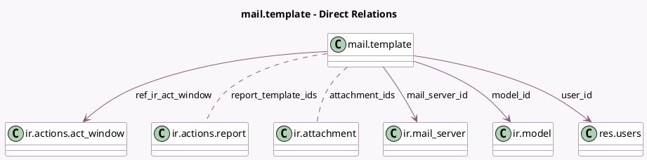

<!-- GENERATED:MODEL -->
---
tags: [odoo, community, generated, model]
---

# mail.template

- Module: [[docs/Community Addons/mail/mail|mail]]
- Scope: Community Addons
- Defined in module: yes
- Source files: `models/mail_template.py`
- Python classes: `MailTemplate`
- Description: Email Templates
- Inherits: `mail.render.mixin`, `template.reset.mixin`

## Field footprint

- Detected fields: 26
- Field types: `Boolean` x 7, `Char` x 10, `Html` x 1, `Many2many` x 2, `Many2one` x 4, `Selection` x 1, `Text` x 1
- Relation fields: 6

## Sample fields

- `active`: `Boolean`
- `attachment_ids`: `Many2many` (comodel `ir.attachment`)
- `auto_delete`: `Boolean` (comodel `Auto Delete`)
- `body_html`: `Html` (comodel `Body`)
- `can_write`: `Boolean` (compute `_compute_can_write`)
- `description`: `Text` (comodel `Template Description`)
- `email_cc`: `Char` (comodel `Cc`)
- `email_from`: `Char` (comodel `Send From`)
- `email_layout_xmlid`: `Char` (comodel `Email Notification Layout`)
- `email_to`: `Char` (comodel `To (Emails)`)
- `has_dynamic_reports`: `Boolean` (compute `_compute_has_dynamic_reports`)
- `has_mail_server`: `Boolean` (compute `_compute_has_mail_server`)
- `is_template_editor`: `Boolean` (compute `_compute_is_template_editor`)
- `mail_server_id`: `Many2one` (comodel `ir.mail_server`)
- `model`: `Char` (comodel `Related Document Model`, related `model_id.model`, store `True`)
- `model_id`: `Many2one` (comodel `ir.model`)
- `name`: `Char` (comodel `Name`)
- `partner_to`: `Char` (comodel `To (Partners)`)
- `ref_ir_act_window`: `Many2one` (comodel `ir.actions.act_window`)
- `reply_to`: `Char` (comodel `Reply To`)

## Method hints

- Detected methods: 33
- Action methods: `action_open_mail_preview`
- Compute methods: `_compute_can_write`, `_compute_has_dynamic_reports`, `_compute_has_mail_server`, `_compute_is_template_editor`, `_compute_render_model`, `_compute_template_category`
- Onchange methods: `_onchange_model`

## Direct relation diagram

## Navigation

- **Parent:** [[docs/Community Addons/mail/Models]]

<!-- GENERATED:MODEL -->
