<!-- GENERATED:MODEL -->
---
tags: [odoo, community, generated, model]
---

# mail.template.preview

- Module: [[docs/Community Addons/mail/mail|mail]]
- Scope: Community Addons
- Defined in module: yes
- Source files: `wizard/mail_template_preview.py`
- Python classes: `MailTemplatePreview`
- Description: Email Template Preview

## Field footprint

- Detected fields: 17
- Field types: `Boolean` x 3, `Char` x 7, `Html` x 1, `Many2many` x 2, `Many2one` x 2, `Reference` x 1, `Selection` x 1
- Relation fields: 4

## Sample fields

- `attachment_ids`: `Many2many` (comodel `ir.attachment`, compute `_compute_mail_template_fields`)
- `body_html`: `Html` (comodel `Body`, compute `_compute_mail_template_fields`)
- `email_cc`: `Char` (comodel `Cc`, compute `_compute_mail_template_fields`)
- `email_from`: `Char` (comodel `From`, compute `_compute_mail_template_fields`)
- `email_to`: `Char` (comodel `To`, compute `_compute_mail_template_fields`)
- `error_msg`: `Char` (comodel `Error Message`, compute `_compute_mail_template_fields`)
- `has_attachments`: `Boolean` (compute `_compute_has_attachments`)
- `has_several_languages_installed`: `Boolean` (compute `_compute_has_several_languages_installed`)
- `lang`: `Selection`
- `mail_template_id`: `Many2one` (comodel `mail.template`)
- `model_id`: `Many2one` (comodel `ir.model`, related `mail_template_id.model_id`)
- `no_record`: `Boolean` (comodel `No Record`, compute `_compute_no_record`)
- `partner_ids`: `Many2many` (comodel `res.partner`, compute `_compute_mail_template_fields`)
- `reply_to`: `Char` (comodel `Reply-To`, compute `_compute_mail_template_fields`)
- `resource_ref`: `Reference` (compute `_compute_resource_ref`, store `True`)
- `scheduled_date`: `Char` (comodel `Scheduled Date`, compute `_compute_mail_template_fields`)
- `subject`: `Char` (comodel `Subject`, compute `_compute_mail_template_fields`)

## Method hints

- Detected methods: 8
- Action methods: none
- Compute methods: `_compute_has_attachments`, `_compute_has_several_languages_installed`, `_compute_mail_template_fields`, `_compute_no_record`, `_compute_resource_ref`
- Onchange methods: none

## Direct relation diagram

```plantuml
@startuml
!define ODOO_COLOR_PRIMARY #714B67
!define ODOO_COLOR_ACCENT #875A7B
!define ODOO_COLOR_BG #FAF7FA

skinparam backgroundColor ODOO_COLOR_BG
skinparam defaultTextAlignment left
skinparam ArrowColor ODOO_COLOR_ACCENT
skinparam ClassBackgroundColor white
skinparam ClassBorderColor ODOO_COLOR_PRIMARY
skinparam ComponentBackgroundColor white
skinparam ComponentBorderColor ODOO_COLOR_PRIMARY
skinparam NoteBackgroundColor #FFF8FF
skinparam NoteBorderColor ODOO_COLOR_ACCENT
skinparam SequenceLifeLineBorderColor ODOO_COLOR_ACCENT
skinparam SequenceLifeLineBackgroundColor #FFFFFF
skinparam SequenceParticipantBorderColor ODOO_COLOR_PRIMARY
skinparam SequenceParticipantBackgroundColor #FFFFFF
skinparam sequence {
  ArrowColor ODOO_COLOR_ACCENT
  ActorBorderColor ODOO_COLOR_PRIMARY
}
title mail.template.preview - Direct Relations
class "mail.template.preview" as mail_template_preview
class "ir.attachment" as ir_attachment
class "ir.model" as ir_model
class "mail.template" as mail_template
class "res.partner" as res_partner
mail_template_preview --> mail_template : mail_template_id
mail_template_preview --> ir_model : model_id
mail_template_preview .. ir_attachment : attachment_ids
mail_template_preview .. res_partner : partner_ids
@enduml
```

## Navigation

- **Parent:** [[docs/Community Addons/mail/Models]]

<!-- GENERATED:MODEL -->
