<!-- GENERATED:MODEL -->
---
tags: [odoo, community, generated, model]
---

# mail.thread

- Module: [[docs/Community Addons/mail/mail|mail]]
- Scope: Community Addons
- Defined in module: yes
- Source files: `models/mail_thread.py`
- Python classes: `MailThread`
- Description: Email Thread

## Field footprint

- Detected fields: 10
- Field types: `Boolean` x 4, `Integer` x 3, `Many2many` x 1, `One2many` x 2
- Relation fields: 3

## Sample fields

- `has_message`: `Boolean` (compute `_compute_has_message`, store `False`)
- `message_attachment_count`: `Integer` (comodel `Attachment Count`, compute `_compute_message_attachment_count`)
- `message_follower_ids`: `One2many` (comodel `mail.followers`)
- `message_has_error`: `Boolean` (comodel `Message Delivery error`, compute `_compute_message_has_error`)
- `message_has_error_counter`: `Integer` (comodel `Number of errors`, compute `_compute_message_has_error`)
- `message_ids`: `One2many` (comodel `mail.message`)
- `message_is_follower`: `Boolean` (comodel `Is Follower`, compute `_compute_message_is_follower`)
- `message_needaction`: `Boolean` (comodel `Action Needed`, compute `_compute_message_needaction`)
- `message_needaction_counter`: `Integer` (comodel `Number of Actions`, compute `_compute_message_needaction`)
- `message_partner_ids`: `Many2many` (comodel `res.partner`, compute `_compute_message_partner_ids`)

## Method hints

- Detected methods: 136
- Action methods: none
- Compute methods: `_compute_field_value`, `_compute_has_message`, `_compute_message_attachment_count`, `_compute_message_has_error`, `_compute_message_is_follower`, `_compute_message_needaction`, `_compute_message_partner_ids`
- Onchange methods: none

## Direct relation diagram

```plantuml
@startuml
!define ODOO_COLOR_PRIMARY #714B67
!define ODOO_COLOR_ACCENT #875A7B
!define ODOO_COLOR_BG #FAF7FA

skinparam backgroundColor ODOO_COLOR_BG
skinparam defaultTextAlignment left
skinparam ArrowColor ODOO_COLOR_ACCENT
skinparam ClassBackgroundColor white
skinparam ClassBorderColor ODOO_COLOR_PRIMARY
skinparam ComponentBackgroundColor white
skinparam ComponentBorderColor ODOO_COLOR_PRIMARY
skinparam NoteBackgroundColor #FFF8FF
skinparam NoteBorderColor ODOO_COLOR_ACCENT
skinparam SequenceLifeLineBorderColor ODOO_COLOR_ACCENT
skinparam SequenceLifeLineBackgroundColor #FFFFFF
skinparam SequenceParticipantBorderColor ODOO_COLOR_PRIMARY
skinparam SequenceParticipantBackgroundColor #FFFFFF
skinparam sequence {
  ArrowColor ODOO_COLOR_ACCENT
  ActorBorderColor ODOO_COLOR_PRIMARY
}
title mail.thread - Direct Relations
class "mail.thread" as mail_thread
class "mail.followers" as mail_followers
class "mail.message" as mail_message
class "res.partner" as res_partner
mail_thread --|> mail_followers : message_follower_ids
mail_thread .. res_partner : message_partner_ids
mail_thread --|> mail_message : message_ids
@enduml
```

## Navigation

- **Parent:** [[docs/Community Addons/mail/Models]]

<!-- GENERATED:MODEL -->
