<!-- GENERATED:MODEL -->
---
tags: [odoo, community, generated, model]
---

# mail.tracking.value

- Module: [[docs/Community Addons/mail/mail|mail]]
- Scope: Community Addons
- Defined in module: yes
- Source files: `models/mail_tracking_value.py`
- Python classes: `MailTrackingValue`
- Description: Mail Tracking Value

## Field footprint

- Detected fields: 14
- Field types: `Char` x 2, `Datetime` x 2, `Float` x 2, `Integer` x 2, `Json` x 1, `Many2one` x 3, `Text` x 2
- Relation fields: 3

## Sample fields

- `currency_id`: `Many2one` (comodel `res.currency`)
- `field_id`: `Many2one` (comodel `ir.model.fields`)
- `field_info`: `Json` (comodel `Removed field information`)
- `mail_message_id`: `Many2one` (comodel `mail.message`)
- `new_value_char`: `Char` (comodel `New Value Char`)
- `new_value_datetime`: `Datetime` (comodel `New Value Datetime`)
- `new_value_float`: `Float` (comodel `New Value Float`)
- `new_value_integer`: `Integer` (comodel `New Value Integer`)
- `new_value_text`: `Text` (comodel `New Value Text`)
- `old_value_char`: `Char` (comodel `Old Value Char`)
- `old_value_datetime`: `Datetime` (comodel `Old Value DateTime`)
- `old_value_float`: `Float` (comodel `Old Value Float`)
- `old_value_integer`: `Integer` (comodel `Old Value Integer`)
- `old_value_text`: `Text` (comodel `Old Value Text`)

## Method hints

- Detected methods: 7
- Action methods: none
- Compute methods: none
- Onchange methods: none

## Direct relation diagram

```plantuml
@startuml
!define ODOO_COLOR_PRIMARY #714B67
!define ODOO_COLOR_ACCENT #875A7B
!define ODOO_COLOR_BG #FAF7FA

skinparam backgroundColor ODOO_COLOR_BG
skinparam defaultTextAlignment left
skinparam ArrowColor ODOO_COLOR_ACCENT
skinparam ClassBackgroundColor white
skinparam ClassBorderColor ODOO_COLOR_PRIMARY
skinparam ComponentBackgroundColor white
skinparam ComponentBorderColor ODOO_COLOR_PRIMARY
skinparam NoteBackgroundColor #FFF8FF
skinparam NoteBorderColor ODOO_COLOR_ACCENT
skinparam SequenceLifeLineBorderColor ODOO_COLOR_ACCENT
skinparam SequenceLifeLineBackgroundColor #FFFFFF
skinparam SequenceParticipantBorderColor ODOO_COLOR_PRIMARY
skinparam SequenceParticipantBackgroundColor #FFFFFF
skinparam sequence {
  ArrowColor ODOO_COLOR_ACCENT
  ActorBorderColor ODOO_COLOR_PRIMARY
}
title mail.tracking.value - Direct Relations
class "mail.tracking.value" as mail_tracking_value
class "ir.model.fields" as ir_model_fields
class "mail.message" as mail_message
class "res.currency" as res_currency
mail_tracking_value --> ir_model_fields : field_id
mail_tracking_value --> res_currency : currency_id
mail_tracking_value --> mail_message : mail_message_id
@enduml
```

## Navigation

- **Parent:** [[docs/Community Addons/mail/Models]]

<!-- GENERATED:MODEL -->
