<!-- GENERATED:MODEL -->
---
tags: [odoo, community, generated, model]
---

# res.company

- Module: [[docs/Community Addons/mail/mail|mail]]
- Scope: Community Addons
- Defined in module: extension only
- Source files: `models/res_company.py`
- Python classes: `ResCompany`

## Field footprint

- Detected fields: 9
- Field types: `Char` x 8, `Many2one` x 1
- Relation fields: 1

## Sample fields

- `alias_domain_id`: `Many2one` (comodel `mail.alias.domain`)
- `bounce_email`: `Char` (compute `_compute_bounce`)
- `bounce_formatted`: `Char` (compute `_compute_bounce`)
- `catchall_email`: `Char` (compute `_compute_catchall`)
- `catchall_formatted`: `Char` (compute `_compute_catchall`)
- `default_from_email`: `Char` (related `alias_domain_id.default_from_email`)
- `email_formatted`: `Char` (compute `_compute_email_formatted`)
- `email_primary_color`: `Char` (comodel `Email Button Text`)
- `email_secondary_color`: `Char` (comodel `Email Button Color`)

## Method hints

- Detected methods: 4
- Action methods: none
- Compute methods: `_compute_bounce`, `_compute_catchall`, `_compute_email_formatted`
- Onchange methods: none

## Direct relation diagram

```plantuml
@startuml
!define ODOO_COLOR_PRIMARY #714B67
!define ODOO_COLOR_ACCENT #875A7B
!define ODOO_COLOR_BG #FAF7FA

skinparam backgroundColor ODOO_COLOR_BG
skinparam defaultTextAlignment left
skinparam ArrowColor ODOO_COLOR_ACCENT
skinparam ClassBackgroundColor white
skinparam ClassBorderColor ODOO_COLOR_PRIMARY
skinparam ComponentBackgroundColor white
skinparam ComponentBorderColor ODOO_COLOR_PRIMARY
skinparam NoteBackgroundColor #FFF8FF
skinparam NoteBorderColor ODOO_COLOR_ACCENT
skinparam SequenceLifeLineBorderColor ODOO_COLOR_ACCENT
skinparam SequenceLifeLineBackgroundColor #FFFFFF
skinparam SequenceParticipantBorderColor ODOO_COLOR_PRIMARY
skinparam SequenceParticipantBackgroundColor #FFFFFF
skinparam sequence {
  ArrowColor ODOO_COLOR_ACCENT
  ActorBorderColor ODOO_COLOR_PRIMARY
}
title res.company - Direct Relations
class "res.company" as res_company
class "mail.alias.domain" as mail_alias_domain
res_company --> mail_alias_domain : alias_domain_id
@enduml
```

## Navigation

- **Parent:** [[docs/Community Addons/mail/Models]]

<!-- GENERATED:MODEL -->
