<!-- GENERATED:MODEL -->
---
tags: [odoo, community, generated, model]
---

# res.config.settings

- Module: [[docs/Community Addons/mail/mail|mail]]
- Scope: Community Addons
- Defined in module: extension only
- Source files: `models/res_config_settings.py`
- Python classes: `ResConfigSettings`

## Field footprint

- Detected fields: 16
- Field types: `Boolean` x 6, `Char` x 8, `Integer` x 1, `Many2one` x 1
- Relation fields: 1

## Sample fields

- `alias_domain_id`: `Many2one` (comodel `mail.alias.domain`, related `company_id.alias_domain_id`)
- `email_primary_color`: `Char` (related `company_id.email_primary_color`)
- `email_secondary_color`: `Char` (related `company_id.email_secondary_color`)
- `external_email_server_default`: `Boolean` (comodel `Use Custom Email Servers`)
- `fail_counter`: `Integer` (comodel `Fail Mail`, compute `_compute_fail_counter`)
- `google_translate_api_key`: `Char` (comodel `Message Translation API Key`)
- `module_google_gmail`: `Boolean` (comodel `Support Gmail Authentication`)
- `module_microsoft_outlook`: `Boolean` (comodel `Support Outlook Authentication`)
- `restrict_template_rendering`: `Boolean` (comodel `Restrict Template Rendering`)
- `sfu_server_key`: `Char` (comodel `SFU Server key`)
- `sfu_server_url`: `Char` (comodel `SFU Server URL`)
- `tenor_api_key`: `Char` (comodel `Tenor API key`)
- `twilio_account_sid`: `Char` (comodel `Account SID`)
- `twilio_account_token`: `Char` (comodel `Account Auth Token`)
- `use_sfu_server`: `Boolean` (comodel `Use SFU server`)
- `use_twilio_rtc_servers`: `Boolean` (comodel `Use Twilio ICE servers`)

## Method hints

- Detected methods: 3
- Action methods: none
- Compute methods: `_compute_fail_counter`
- Onchange methods: none

## Direct relation diagram

```plantuml
@startuml
!define ODOO_COLOR_PRIMARY #714B67
!define ODOO_COLOR_ACCENT #875A7B
!define ODOO_COLOR_BG #FAF7FA

skinparam backgroundColor ODOO_COLOR_BG
skinparam defaultTextAlignment left
skinparam ArrowColor ODOO_COLOR_ACCENT
skinparam ClassBackgroundColor white
skinparam ClassBorderColor ODOO_COLOR_PRIMARY
skinparam ComponentBackgroundColor white
skinparam ComponentBorderColor ODOO_COLOR_PRIMARY
skinparam NoteBackgroundColor #FFF8FF
skinparam NoteBorderColor ODOO_COLOR_ACCENT
skinparam SequenceLifeLineBorderColor ODOO_COLOR_ACCENT
skinparam SequenceLifeLineBackgroundColor #FFFFFF
skinparam SequenceParticipantBorderColor ODOO_COLOR_PRIMARY
skinparam SequenceParticipantBackgroundColor #FFFFFF
skinparam sequence {
  ArrowColor ODOO_COLOR_ACCENT
  ActorBorderColor ODOO_COLOR_PRIMARY
}
title res.config.settings - Direct Relations
class "res.config.settings" as res_config_settings
class "mail.alias.domain" as mail_alias_domain
res_config_settings --> mail_alias_domain : alias_domain_id
@enduml
```

## Navigation

- **Parent:** [[docs/Community Addons/mail/Models]]

<!-- GENERATED:MODEL -->
