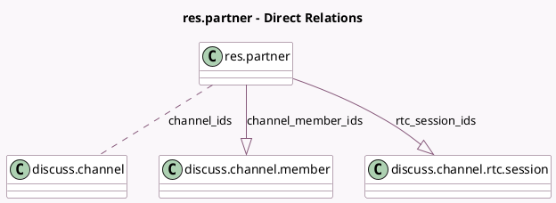

<!-- GENERATED:MODEL -->
---
tags: [odoo, community, generated, model]
---

# res.partner

- Module: [[docs/Community Addons/mail/mail|mail]]
- Scope: Community Addons
- Defined in module: yes
- Source files: `models/discuss/res_partner.py`, `models/res_partner.py`
- Python classes: `ResPartner`
- Inherits: `mail.activity.mixin`, `mail.thread.blacklist`

## Field footprint

- Detected fields: 13
- Field types: `Boolean` x 1, `Char` x 6, `Datetime` x 1, `Many2many` x 1, `Many2one` x 2, `One2many` x 2
- Relation fields: 5

## Sample fields

- `channel_ids`: `Many2many` (comodel `discuss.channel`)
- `channel_member_ids`: `One2many` (comodel `discuss.channel.member`)
- `contact_address_inline`: `Char` (compute `_compute_contact_address_inline`)
- `email`: `Char`
- `im_status`: `Char` (comodel `IM Status`, compute `_compute_im_status`)
- `is_in_call`: `Boolean` (compute `_compute_is_in_call`)
- `name`: `Char`
- `offline_since`: `Datetime` (comodel `Offline since`, compute `_compute_im_status`)
- `parent_id`: `Many2one`
- `phone`: `Char`
- `rtc_session_ids`: `One2many` (comodel `discuss.channel.rtc.session`)
- `user_id`: `Many2one`
- `vat`: `Char`

## Method hints

- Detected methods: 22
- Action methods: none
- Compute methods: `_compute_contact_address_inline`, `_compute_im_status`, `_compute_is_in_call`
- Onchange methods: none

## Direct relation diagram

## Navigation

- **Parent:** [[docs/Community Addons/mail/Models]]

<!-- GENERATED:MODEL -->
