<!-- GENERATED:MODEL -->
---
tags: [odoo, community, generated, model]
---

# res.users

- Module: [[docs/Community Addons/mail/mail|mail]]
- Scope: Community Addons
- Defined in module: extension only
- Source files: `models/discuss/res_users.py`, `models/res_users.py`
- Python classes: `ResUsers`

## Field footprint

- Detected fields: 14
- Field types: `Boolean` x 4, `Char` x 1, `Datetime` x 2, `Html` x 1, `Many2many` x 1, `Many2one` x 1, `One2many` x 1, `Selection` x 3
- Relation fields: 3

## Sample fields

- `can_edit_role`: `Boolean` (compute `_compute_can_edit_role`)
- `has_external_mail_server`: `Boolean` (compute `_compute_has_external_mail_server`)
- `im_status`: `Char` (comodel `IM Status`, compute `_compute_im_status`)
- `is_in_call`: `Boolean` (comodel `Is in call`, related `partner_id.is_in_call`)
- `is_out_of_office`: `Boolean` (comodel `Out of Office`, compute `_compute_is_out_of_office`)
- `manual_im_status`: `Selection`
- `notification_type`: `Selection` (compute `_compute_notification_type`, store `True`)
- `out_of_office_from`: `Datetime`
- `out_of_office_message`: `Html` (comodel `Vacation Responder`)
- `out_of_office_to`: `Datetime`
- `outgoing_mail_server_id`: `Many2one` (comodel `ir.mail_server`, compute `_compute_outgoing_mail_server_id`)
- `outgoing_mail_server_type`: `Selection` (compute `_compute_outgoing_mail_server_id`)
- `presence_ids`: `One2many` (comodel `mail.presence`)
- `role_ids`: `Many2many` (comodel `res.role`)

## Method hints

- Detected methods: 27
- Action methods: `action_archive`, `action_setup_outgoing_mail_server`, `action_test_outgoing_mail_server`
- Compute methods: `_compute_can_edit_role`, `_compute_has_external_mail_server`, `_compute_im_status`, `_compute_is_out_of_office`, `_compute_notification_type`, `_compute_outgoing_mail_server_id`
- Onchange methods: none

## Direct relation diagram

```plantuml
@startuml
!define ODOO_COLOR_PRIMARY #714B67
!define ODOO_COLOR_ACCENT #875A7B
!define ODOO_COLOR_BG #FAF7FA

skinparam backgroundColor ODOO_COLOR_BG
skinparam defaultTextAlignment left
skinparam ArrowColor ODOO_COLOR_ACCENT
skinparam ClassBackgroundColor white
skinparam ClassBorderColor ODOO_COLOR_PRIMARY
skinparam ComponentBackgroundColor white
skinparam ComponentBorderColor ODOO_COLOR_PRIMARY
skinparam NoteBackgroundColor #FFF8FF
skinparam NoteBorderColor ODOO_COLOR_ACCENT
skinparam SequenceLifeLineBorderColor ODOO_COLOR_ACCENT
skinparam SequenceLifeLineBackgroundColor #FFFFFF
skinparam SequenceParticipantBorderColor ODOO_COLOR_PRIMARY
skinparam SequenceParticipantBackgroundColor #FFFFFF
skinparam sequence {
  ArrowColor ODOO_COLOR_ACCENT
  ActorBorderColor ODOO_COLOR_PRIMARY
}
title res.users - Direct Relations
class "res.users" as res_users
class "ir.mail_server" as ir_mail_server
class "mail.presence" as mail_presence
class "res.role" as res_role
res_users .. res_role : role_ids
res_users --|> mail_presence : presence_ids
res_users --> ir_mail_server : outgoing_mail_server_id
@enduml
```

## Navigation

- **Parent:** [[docs/Community Addons/mail/Models]]

<!-- GENERATED:MODEL -->
