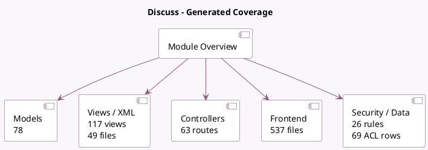

<!-- GENERATED:MODULE -->
---
tags: [odoo, community, module]
---

# Discuss

- Scope: Community Addons
- Source: odoo/addons/mail
- Dependencies: base (not documented), [[docs/Community Addons/base_setup/base_setup|base_setup]], [[docs/Community Addons/bus/bus|bus]], [[docs/Community Addons/web_tour/web_tour|web_tour]], [[docs/Community Addons/html_editor/html_editor|html_editor]]

## Summary

Chat, mail gateway and private channels

## Generated coverage

- Models: 78
- XML files with UI/data artifacts: 49
- Views: 117
- Actions: 55
- Menus: 39
- Rules (ir.rule): 26
- Access CSV entries: 69
- Controller units: 18
- Frontend asset files: 537

## Module map

## Detail notes

- Models: [[docs/Community Addons/mail/Models|Models]] (78)
- Views and XML: [[docs/Community Addons/mail/Views|Views]] (49 files)
- Controllers: [[docs/Community Addons/mail/Controllers|Controllers]] (18)
- Frontend: [[docs/Community Addons/mail/Frontend|Frontend]] (537 files)

## Key models

- `base`
- `base.module.uninstall`
- `base.partner.merge.automatic.wizard`
- `bus.listener.mixin`
- `discuss.call.history`
- `discuss.channel`
- `discuss.channel.member`
- `discuss.channel.rtc.session`
- `discuss.gif.favorite`
- `discuss.voice.metadata`
- `fetchmail.server`
- `ir.actions.act_window.view`

## Navigation

- [[../Community Addons/Community Addons|Back to scope]]
- [[../../docs/docs|Back to docs]]

<!-- GENERATED:MODULE -->

