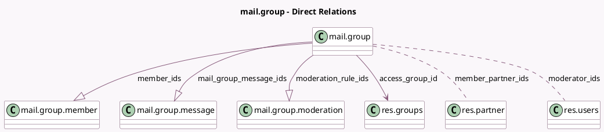

<!-- GENERATED:MODEL -->
---
tags: [odoo, community, generated, model]
---

# mail.group

- Module: [[docs/Community Addons/mail_group/mail_group|mail_group]]
- Scope: Community Addons
- Defined in module: yes
- Source files: `models/mail_group.py`
- Python classes: `MailGroup`
- Description: Mail Group
- Inherits: `mail.alias.mixin`

## Field footprint

- Detected fields: 25
- Field types: `Boolean` x 8, `Char` x 1, `Html` x 2, `Image` x 1, `Integer` x 5, `Many2many` x 2, `Many2one` x 1, `One2many` x 3, `Selection` x 1, `Text` x 1
- Relation fields: 6

## Sample fields

- `access_group_id`: `Many2one` (comodel `res.groups`)
- `access_mode`: `Selection`
- `active`: `Boolean` (comodel `Active`)
- `can_manage_group`: `Boolean` (comodel `Can Manage`, compute `_compute_can_manage_group`)
- `description`: `Text` (comodel `Description`)
- `image_128`: `Image` (comodel `Image`)
- `is_closed`: `Boolean` (comodel `Is Closed`)
- `is_member`: `Boolean` (comodel `Is Member`, compute `_compute_is_member`)
- `is_moderator`: `Boolean` (compute `_compute_is_moderator`)
- `mail_group_message_count`: `Integer` (comodel `Messages Count`, compute `_compute_mail_group_message_count`)
- `mail_group_message_ids`: `One2many` (comodel `mail.group.message`)
- `mail_group_message_last_month_count`: `Integer` (comodel `Messages Per Month`, compute `_compute_mail_group_message_last_month_count`)
- `mail_group_message_moderation_count`: `Integer` (comodel `Pending Messages Count`, compute `_compute_mail_group_message_moderation_count`)
- `member_count`: `Integer` (comodel `Members Count`, compute `_compute_member_count`)
- `member_ids`: `One2many` (comodel `mail.group.member`)
- `member_partner_ids`: `Many2many` (comodel `res.partner`, compute `_compute_member_partner_ids`)
- `moderation`: `Boolean`
- `moderation_guidelines`: `Boolean`
- `moderation_guidelines_msg`: `Html`
- `moderation_notify`: `Boolean`

## Method hints

- Detected methods: 44
- Action methods: `action_close`, `action_join`, `action_leave`, `action_open`, `action_send_guidelines`
- Compute methods: `_compute_can_manage_group`, `_compute_is_member`, `_compute_is_moderator`, `_compute_mail_group_message_count`, `_compute_mail_group_message_last_month_count`, `_compute_mail_group_message_moderation_count`, `_compute_member_count`, `_compute_member_partner_ids`, and 1 more
- Onchange methods: `_onchange_access_mode`, `_onchange_moderation`

## Direct relation diagram

## Navigation

- **Parent:** [[docs/Community Addons/mail_group/Models]]

<!-- GENERATED:MODEL -->
