<!-- GENERATED:MODEL -->
---
tags: [odoo, community, generated, model]
---

# mail.group.member

- Module: [[docs/Community Addons/mail_group/mail_group|mail_group]]
- Scope: Community Addons
- Defined in module: yes
- Source files: `models/mail_group_member.py`
- Python classes: `MailGroupMember`
- Description: Mailing List Member

## Field footprint

- Detected fields: 4
- Field types: `Char` x 2, `Many2one` x 2
- Relation fields: 2

## Sample fields

- `email`: `Char` (compute `_compute_email`, store `True`)
- `email_normalized`: `Char` (compute `_compute_email_normalized`, store `True`)
- `mail_group_id`: `Many2one` (comodel `mail.group`)
- `partner_id`: `Many2one` (comodel `res.partner`)

## Method hints

- Detected methods: 2
- Action methods: none
- Compute methods: `_compute_email`, `_compute_email_normalized`
- Onchange methods: none

## Direct relation diagram

```plantuml
@startuml
!define ODOO_COLOR_PRIMARY #714B67
!define ODOO_COLOR_ACCENT #875A7B
!define ODOO_COLOR_BG #FAF7FA

skinparam backgroundColor ODOO_COLOR_BG
skinparam defaultTextAlignment left
skinparam ArrowColor ODOO_COLOR_ACCENT
skinparam ClassBackgroundColor white
skinparam ClassBorderColor ODOO_COLOR_PRIMARY
skinparam ComponentBackgroundColor white
skinparam ComponentBorderColor ODOO_COLOR_PRIMARY
skinparam NoteBackgroundColor #FFF8FF
skinparam NoteBorderColor ODOO_COLOR_ACCENT
skinparam SequenceLifeLineBorderColor ODOO_COLOR_ACCENT
skinparam SequenceLifeLineBackgroundColor #FFFFFF
skinparam SequenceParticipantBorderColor ODOO_COLOR_PRIMARY
skinparam SequenceParticipantBackgroundColor #FFFFFF
skinparam sequence {
  ArrowColor ODOO_COLOR_ACCENT
  ActorBorderColor ODOO_COLOR_PRIMARY
}
title mail.group.member - Direct Relations
class "mail.group.member" as mail_group_member
class "mail.group" as mail_group
class "res.partner" as res_partner
mail_group_member --> mail_group : mail_group_id
mail_group_member --> res_partner : partner_id
@enduml
```

## Navigation

- **Parent:** [[docs/Community Addons/mail_group/Models]]

<!-- GENERATED:MODEL -->
