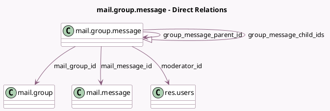

<!-- GENERATED:MODEL -->
---
tags: [odoo, community, generated, model]
---

# mail.group.message

- Module: [[docs/Community Addons/mail_group/mail_group|mail_group]]
- Scope: Community Addons
- Defined in module: yes
- Source files: `models/mail_group_message.py`
- Python classes: `MailGroupMessage`
- Description: Mailing List Message

## Field footprint

- Detected fields: 15
- Field types: `Boolean` x 1, `Char` x 3, `Datetime` x 1, `Html` x 1, `Many2many` x 1, `Many2one` x 5, `One2many` x 1, `Selection` x 2
- Relation fields: 7

## Sample fields

- `attachment_ids`: `Many2many` (related `mail_message_id.attachment_ids`)
- `author_id`: `Many2one` (related `mail_message_id.author_id`)
- `author_moderation`: `Selection` (compute `_compute_author_moderation`)
- `body`: `Html` (related `mail_message_id.body`)
- `create_date`: `Datetime`
- `email_from`: `Char` (related `mail_message_id.email_from`)
- `email_from_normalized`: `Char` (comodel `Normalized From`, compute `_compute_email_from_normalized`, store `True`)
- `group_message_child_ids`: `One2many` (comodel `mail.group.message`)
- `group_message_parent_id`: `Many2one` (comodel `mail.group.message`, store `True`)
- `is_group_moderated`: `Boolean` (comodel `Is Group Moderated`, related `mail_group_id.moderation`)
- `mail_group_id`: `Many2one` (comodel `mail.group`)
- `mail_message_id`: `Many2one` (comodel `mail.message`)
- `moderation_status`: `Selection`
- `moderator_id`: `Many2one` (comodel `res.users`)
- `subject`: `Char` (related `mail_message_id.subject`)

## Method hints

- Detected methods: 15
- Action methods: `action_moderate_accept`, `action_moderate_allow`, `action_moderate_ban`, `action_moderate_ban_with_comment`, `action_moderate_reject`, `action_moderate_reject_with_comment`
- Compute methods: `_compute_author_moderation`, `_compute_email_from_normalized`
- Onchange methods: none

## Direct relation diagram

## Navigation

- **Parent:** [[docs/Community Addons/mail_group/Models]]

<!-- GENERATED:MODEL -->
