<!-- GENERATED:MODEL -->
---
tags: [odoo, community, generated, model]
---

# mail.group.message.reject

- Module: [[docs/Community Addons/mail_group/mail_group|mail_group]]
- Scope: Community Addons
- Defined in module: yes
- Source files: `wizard/mail_group_message_reject.py`
- Python classes: `MailGroupMessageReject`
- Description: Reject Group Message

## Field footprint

- Detected fields: 6
- Field types: `Boolean` x 1, `Char` x 2, `Html` x 1, `Many2one` x 1, `Selection` x 1
- Relation fields: 1

## Sample fields

- `action`: `Selection`
- `body`: `Html` (comodel `Contents`)
- `email_from_normalized`: `Char` (comodel `Email From`, related `mail_group_message_id.email_from_normalized`)
- `mail_group_message_id`: `Many2one` (comodel `mail.group.message`)
- `send_email`: `Boolean` (comodel `Send Email`, compute `_compute_send_email`)
- `subject`: `Char` (comodel `Subject`, compute `_compute_subject`, store `True`)

## Method hints

- Detected methods: 3
- Action methods: `action_send_mail`
- Compute methods: `_compute_send_email`, `_compute_subject`
- Onchange methods: none

## Direct relation diagram

```plantuml
@startuml
!define ODOO_COLOR_PRIMARY #714B67
!define ODOO_COLOR_ACCENT #875A7B
!define ODOO_COLOR_BG #FAF7FA

skinparam backgroundColor ODOO_COLOR_BG
skinparam defaultTextAlignment left
skinparam ArrowColor ODOO_COLOR_ACCENT
skinparam ClassBackgroundColor white
skinparam ClassBorderColor ODOO_COLOR_PRIMARY
skinparam ComponentBackgroundColor white
skinparam ComponentBorderColor ODOO_COLOR_PRIMARY
skinparam NoteBackgroundColor #FFF8FF
skinparam NoteBorderColor ODOO_COLOR_ACCENT
skinparam SequenceLifeLineBorderColor ODOO_COLOR_ACCENT
skinparam SequenceLifeLineBackgroundColor #FFFFFF
skinparam SequenceParticipantBorderColor ODOO_COLOR_PRIMARY
skinparam SequenceParticipantBackgroundColor #FFFFFF
skinparam sequence {
  ArrowColor ODOO_COLOR_ACCENT
  ActorBorderColor ODOO_COLOR_PRIMARY
}
title mail.group.message.reject - Direct Relations
class "mail.group.message.reject" as mail_group_message_reject
class "mail.group.message" as mail_group_message
mail_group_message_reject --> mail_group_message : mail_group_message_id
@enduml
```

## Navigation

- **Parent:** [[docs/Community Addons/mail_group/Models]]

<!-- GENERATED:MODEL -->
