<!-- GENERATED:MODEL -->
---
tags: [odoo, community, generated, model]
---

# mail.group.moderation

- Module: [[docs/Community Addons/mail_group/mail_group|mail_group]]
- Scope: Community Addons
- Defined in module: yes
- Source files: `models/mail_group_moderation.py`
- Python classes: `MailGroupModeration`
- Description: Mailing List black/white list

## Field footprint

- Detected fields: 3
- Field types: `Char` x 1, `Many2one` x 1, `Selection` x 1
- Relation fields: 1

## Sample fields

- `email`: `Char`
- `mail_group_id`: `Many2one` (comodel `mail.group`)
- `status`: `Selection`

## Method hints

- Detected methods: 2
- Action methods: none
- Compute methods: none
- Onchange methods: none

## Direct relation diagram

```plantuml
@startuml
!define ODOO_COLOR_PRIMARY #714B67
!define ODOO_COLOR_ACCENT #875A7B
!define ODOO_COLOR_BG #FAF7FA

skinparam backgroundColor ODOO_COLOR_BG
skinparam defaultTextAlignment left
skinparam ArrowColor ODOO_COLOR_ACCENT
skinparam ClassBackgroundColor white
skinparam ClassBorderColor ODOO_COLOR_PRIMARY
skinparam ComponentBackgroundColor white
skinparam ComponentBorderColor ODOO_COLOR_PRIMARY
skinparam NoteBackgroundColor #FFF8FF
skinparam NoteBorderColor ODOO_COLOR_ACCENT
skinparam SequenceLifeLineBorderColor ODOO_COLOR_ACCENT
skinparam SequenceLifeLineBackgroundColor #FFFFFF
skinparam SequenceParticipantBorderColor ODOO_COLOR_PRIMARY
skinparam SequenceParticipantBackgroundColor #FFFFFF
skinparam sequence {
  ArrowColor ODOO_COLOR_ACCENT
  ActorBorderColor ODOO_COLOR_PRIMARY
}
title mail.group.moderation - Direct Relations
class "mail.group.moderation" as mail_group_moderation
class "mail.group" as mail_group
mail_group_moderation --> mail_group : mail_group_id
@enduml
```

## Navigation

- **Parent:** [[docs/Community Addons/mail_group/Models]]

<!-- GENERATED:MODEL -->
