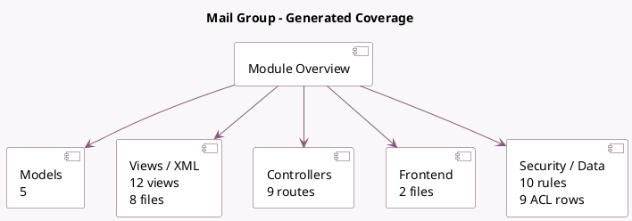

<!-- GENERATED:MODULE -->
---
tags: [odoo, community, module]
---

# Mail Group

- Scope: Community Addons
- Source: odoo/addons/mail_group
- Dependencies: [[docs/Community Addons/mail/mail|mail]], [[docs/Community Addons/portal/portal|portal]]

## Summary

Manage your mailing lists

## Generated coverage

- Models: 5
- XML files with UI/data artifacts: 8
- Views: 12
- Actions: 6
- Menus: 2
- Rules (ir.rule): 10
- Access CSV entries: 9
- Controller units: 1
- Frontend asset files: 2

## Module map

## Detail notes

- Models: [[docs/Community Addons/mail_group/Models|Models]] (5)
- Views and XML: [[docs/Community Addons/mail_group/Views|Views]] (8 files)
- Controllers: [[docs/Community Addons/mail_group/Controllers|Controllers]] (1)
- Frontend: [[docs/Community Addons/mail_group/Frontend|Frontend]] (2 files)

## Key models

- `mail.group`
- `mail.group.member`
- `mail.group.message`
- `mail.group.message.reject`
- `mail.group.moderation`

## Navigation

- [[../Community Addons/Community Addons|Back to scope]]
- [[../../docs/docs|Back to docs]]

<!-- GENERATED:MODULE -->

