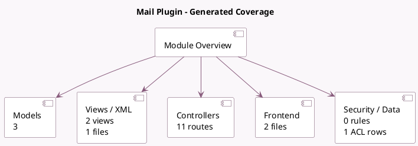

<!-- GENERATED:MODULE -->
---
tags: [odoo, community, module]
---

# Mail Plugin

- Scope: Community Addons
- Source: odoo/addons/mail_plugin
- Dependencies: [[docs/Community Addons/web/web|web]], [[docs/Community Addons/contacts/contacts|contacts]], [[docs/Community Addons/iap/iap|iap]]

## Summary

Allows integration with mail plugins.

## Generated coverage

- Models: 3
- XML files with UI/data artifacts: 1
- Views: 2
- Actions: 1
- Menus: 1
- Rules (ir.rule): 0
- Access CSV entries: 1
- Controller units: 2
- Frontend asset files: 2

## Module map

## Detail notes

- Models: [[docs/Community Addons/mail_plugin/Models|Models]] (3)
- Views and XML: [[docs/Community Addons/mail_plugin/Views|Views]] (1 files)
- Controllers: [[docs/Community Addons/mail_plugin/Controllers|Controllers]] (2)
- Frontend: [[docs/Community Addons/mail_plugin/Frontend|Frontend]] (2 files)

## Key models

- `ir.http`
- `res.partner`
- `res.partner.iap`

## Navigation

- [[../Community Addons/Community Addons|Back to scope]]
- [[../../docs/docs|Back to docs]]

<!-- GENERATED:MODULE -->

