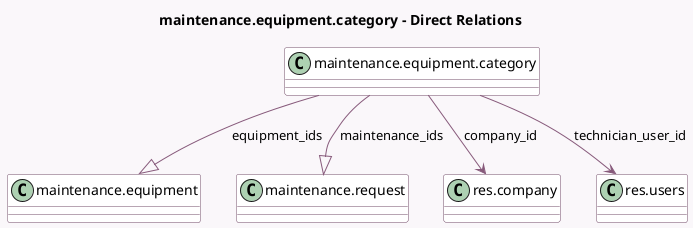

<!-- GENERATED:MODEL -->
---
tags: [odoo, community, generated, model]
---

# maintenance.equipment.category

- Module: [[docs/Community Addons/maintenance/maintenance|maintenance]]
- Scope: Community Addons
- Defined in module: yes
- Source files: `models/maintenance.py`
- Python classes: `MaintenanceEquipmentCategory`
- Description: Maintenance Equipment Category

## Field footprint

- Detected fields: 12
- Field types: `Boolean` x 1, `Char` x 1, `Html` x 1, `Integer` x 4, `Many2one` x 2, `One2many` x 2, `PropertiesDefinition` x 1
- Relation fields: 4

## Sample fields

- `color`: `Integer` (comodel `Color Index`)
- `company_id`: `Many2one` (comodel `res.company`)
- `equipment_count`: `Integer` (compute `_compute_equipment_count`)
- `equipment_ids`: `One2many` (comodel `maintenance.equipment`)
- `equipment_properties_definition`: `PropertiesDefinition` (comodel `Equipment Properties`)
- `fold`: `Boolean` (compute `_compute_fold`, store `True`)
- `maintenance_count`: `Integer` (compute `_compute_maintenance_count`)
- `maintenance_ids`: `One2many` (comodel `maintenance.request`)
- `maintenance_open_count`: `Integer` (compute `_compute_maintenance_count`)
- `name`: `Char` (comodel `Category Name`)
- `note`: `Html` (comodel `Comments`)
- `technician_user_id`: `Many2one` (comodel `res.users`)

## Method hints

- Detected methods: 4
- Action methods: none
- Compute methods: `_compute_equipment_count`, `_compute_fold`, `_compute_maintenance_count`
- Onchange methods: none

## Direct relation diagram

## Navigation

- **Parent:** [[docs/Community Addons/maintenance/Models]]

<!-- GENERATED:MODEL -->
