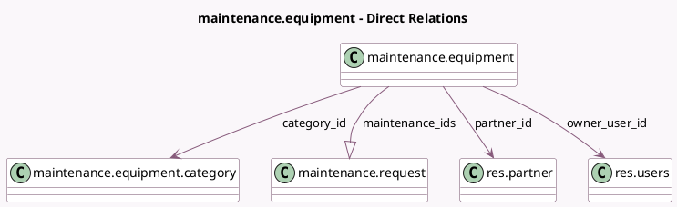

<!-- GENERATED:MODEL -->
---
tags: [odoo, community, generated, model]
---

# maintenance.equipment

- Module: [[docs/Community Addons/maintenance/maintenance|maintenance]]
- Scope: Community Addons
- Defined in module: yes
- Source files: `models/maintenance.py`
- Python classes: `MaintenanceEquipment`
- Description: Maintenance Equipment
- Inherits: `mail.activity.mixin`, `mail.thread`, `maintenance.mixin`

## Field footprint

- Detected fields: 16
- Field types: `Boolean` x 1, `Char` x 4, `Date` x 3, `Float` x 1, `Html` x 1, `Integer` x 1, `Many2one` x 3, `One2many` x 1, `Properties` x 1
- Relation fields: 4

## Sample fields

- `active`: `Boolean`
- `assign_date`: `Date` (comodel `Assigned Date`)
- `category_id`: `Many2one` (comodel `maintenance.equipment.category`)
- `color`: `Integer` (comodel `Color Index`)
- `cost`: `Float` (comodel `Cost`)
- `equipment_properties`: `Properties` (comodel `Properties`)
- `maintenance_ids`: `One2many` (comodel `maintenance.request`)
- `model`: `Char` (comodel `Model`)
- `name`: `Char` (comodel `Equipment Name`)
- `note`: `Html` (comodel `Note`)
- `owner_user_id`: `Many2one` (comodel `res.users`)
- `partner_id`: `Many2one` (comodel `res.partner`)
- `partner_ref`: `Char` (comodel `Vendor Reference`)
- `scrap_date`: `Date` (comodel `Scrap Date`)
- `serial_no`: `Char` (comodel `Serial Number`)
- `warranty_date`: `Date` (comodel `Warranty Expiration Date`)

## Method hints

- Detected methods: 6
- Action methods: none
- Compute methods: `_compute_display_name`
- Onchange methods: `_onchange_category_id`

## Direct relation diagram

## Navigation

- **Parent:** [[docs/Community Addons/maintenance/Models]]

<!-- GENERATED:MODEL -->
