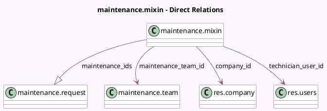

<!-- GENERATED:MODEL -->
---
tags: [odoo, community, generated, model]
---

# maintenance.mixin

- Module: [[docs/Community Addons/maintenance/maintenance|maintenance]]
- Scope: Community Addons
- Defined in module: yes
- Source files: `models/maintenance.py`
- Python classes: `MaintenanceMixin`
- Description: Maintenance Maintained Item

## Field footprint

- Detected fields: 12
- Field types: `Date` x 3, `Integer` x 5, `Many2one` x 3, `One2many` x 1
- Relation fields: 4

## Sample fields

- `company_id`: `Many2one` (comodel `res.company`)
- `effective_date`: `Date` (comodel `Effective Date`)
- `estimated_next_failure`: `Date` (compute `_compute_maintenance_request`)
- `expected_mtbf`: `Integer`
- `latest_failure_date`: `Date` (compute `_compute_maintenance_request`)
- `maintenance_count`: `Integer` (compute `_compute_maintenance_count`, store `True`)
- `maintenance_ids`: `One2many` (comodel `maintenance.request`)
- `maintenance_open_count`: `Integer` (compute `_compute_maintenance_count`, store `True`)
- `maintenance_team_id`: `Many2one` (comodel `maintenance.team`, compute `_compute_maintenance_team_id`, store `True`)
- `mtbf`: `Integer` (compute `_compute_maintenance_request`)
- `mttr`: `Integer` (compute `_compute_maintenance_request`)
- `technician_user_id`: `Many2one` (comodel `res.users`)

## Method hints

- Detected methods: 3
- Action methods: none
- Compute methods: `_compute_maintenance_count`, `_compute_maintenance_request`, `_compute_maintenance_team_id`
- Onchange methods: none

## Direct relation diagram

## Navigation

- **Parent:** [[docs/Community Addons/maintenance/Models]]

<!-- GENERATED:MODEL -->
