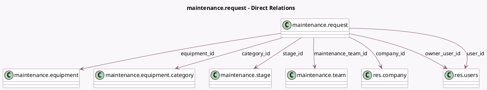

<!-- GENERATED:MODEL -->
---
tags: [odoo, community, generated, model]
---

# maintenance.request

- Module: [[docs/Community Addons/maintenance/maintenance|maintenance]]
- Scope: Community Addons
- Defined in module: yes
- Source files: `models/maintenance.py`
- Python classes: `MaintenanceRequest`
- Description: Maintenance Request
- Inherits: `mail.activity.mixin`, `mail.thread.cc`

## Field footprint

- Detected fields: 29
- Field types: `Binary` x 1, `Boolean` x 3, `Char` x 2, `Date` x 3, `Datetime` x 2, `Float` x 1, `Html` x 2, `Integer` x 2, `Many2one` x 7, `Selection` x 6
- Relation fields: 7

## Sample fields

- `archive`: `Boolean`
- `category_id`: `Many2one` (comodel `maintenance.equipment.category`, related `equipment_id.category_id`, store `True`)
- `close_date`: `Date` (comodel `Close Date`)
- `color`: `Integer` (comodel `Color Index`)
- `company_id`: `Many2one` (comodel `res.company`)
- `description`: `Html` (comodel `Description`)
- `done`: `Boolean` (related `stage_id.done`)
- `duration`: `Float` (compute `_compute_duration`, store `True`)
- `equipment_id`: `Many2one` (comodel `maintenance.equipment`)
- `instruction_google_slide`: `Char` (comodel `Google Slide`)
- `instruction_pdf`: `Binary` (comodel `PDF`)
- `instruction_text`: `Html` (comodel `Text`)
- `instruction_type`: `Selection`
- `kanban_state`: `Selection`
- `maintenance_team_id`: `Many2one` (comodel `maintenance.team`, compute `_compute_maintenance_team_id`, store `True`)
- `maintenance_type`: `Selection`
- `name`: `Char` (comodel `Subjects`)
- `owner_user_id`: `Many2one` (comodel `res.users`)
- `priority`: `Selection`
- `recurring_maintenance`: `Boolean` (compute `_compute_recurring_maintenance`, store `True`)

## Method hints

- Detected methods: 20
- Action methods: none
- Compute methods: `_compute_duration`, `_compute_maintenance_team_id`, `_compute_recurring_maintenance`, `_compute_schedule_end`, `_compute_user_id`
- Onchange methods: none

## Direct relation diagram

## Navigation

- **Parent:** [[docs/Community Addons/maintenance/Models]]

<!-- GENERATED:MODEL -->
