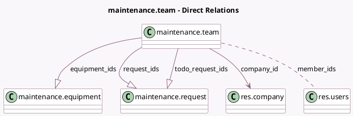

<!-- GENERATED:MODEL -->
---
tags: [odoo, community, generated, model]
---

# maintenance.team

- Module: [[docs/Community Addons/maintenance/maintenance|maintenance]]
- Scope: Community Addons
- Defined in module: yes
- Source files: `models/maintenance.py`
- Python classes: `MaintenanceTeam`
- Description: Maintenance Teams
- Inherits: `mail.alias.mixin`, `mail.thread`

## Field footprint

- Detected fields: 14
- Field types: `Boolean` x 1, `Char` x 1, `Integer` x 6, `Many2many` x 1, `Many2one` x 2, `One2many` x 3
- Relation fields: 6

## Sample fields

- `active`: `Boolean`
- `alias_id`: `Many2one`
- `color`: `Integer` (comodel `Color Index`)
- `company_id`: `Many2one` (comodel `res.company`)
- `equipment_ids`: `One2many` (comodel `maintenance.equipment`)
- `member_ids`: `Many2many` (comodel `res.users`)
- `name`: `Char` (comodel `Team Name`)
- `request_ids`: `One2many` (comodel `maintenance.request`)
- `todo_request_count`: `Integer` (compute `_compute_todo_requests`)
- `todo_request_count_block`: `Integer` (compute `_compute_todo_requests`)
- `todo_request_count_date`: `Integer` (compute `_compute_todo_requests`)
- `todo_request_count_high_priority`: `Integer` (compute `_compute_todo_requests`)
- `todo_request_count_unscheduled`: `Integer` (compute `_compute_todo_requests`)
- `todo_request_ids`: `One2many` (comodel `maintenance.request`, compute `_compute_todo_requests`)

## Method hints

- Detected methods: 3
- Action methods: none
- Compute methods: `_compute_equipment`, `_compute_todo_requests`
- Onchange methods: none

## Direct relation diagram

## Navigation

- **Parent:** [[docs/Community Addons/maintenance/Models]]

<!-- GENERATED:MODEL -->
