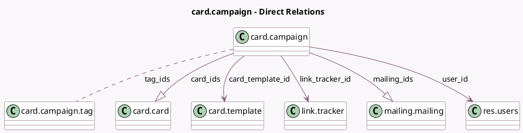

<!-- GENERATED:MODEL -->
---
tags: [odoo, community, generated, model]
---

# card.campaign

- Module: [[docs/Community Addons/marketing_card/marketing_card|marketing_card]]
- Scope: Community Addons
- Defined in module: yes
- Source files: `models/card_campaign.py`
- Python classes: `CardCampaign`
- Description: Marketing Card Campaign
- Inherits: `mail.activity.mixin`, `mail.render.mixin`, `mail.thread`

## Field footprint

- Detected fields: 44
- Field types: `Boolean` x 6, `Char` x 19, `Html` x 2, `Image` x 2, `Integer` x 5, `Many2many` x 1, `Many2one` x 3, `One2many` x 2, `Reference` x 1, `Selection` x 1, `Text` x 2
- Relation fields: 6

## Sample fields

- `active`: `Boolean`
- `body_html`: `Html` (related `card_template_id.body`)
- `card_click_count`: `Integer` (compute `_compute_card_stats`)
- `card_count`: `Integer` (compute `_compute_card_stats`)
- `card_ids`: `One2many` (comodel `card.card`)
- `card_share_count`: `Integer` (compute `_compute_card_stats`)
- `card_template_id`: `Many2one` (comodel `card.template`)
- `content_background`: `Image` (comodel `Background`)
- `content_button`: `Char` (comodel `Button`)
- `content_header`: `Char` (comodel `Header`)
- `content_header_color`: `Char` (comodel `Header Color`)
- `content_header_dyn`: `Boolean` (comodel `Is Dynamic Header`)
- `content_header_path`: `Char` (comodel `Header Path`)
- `content_image1_path`: `Char` (comodel `Dynamic Image 1`)
- `content_image2_path`: `Char` (comodel `Dynamic Image 2`)
- `content_section`: `Char` (comodel `Section`)
- `content_section_dyn`: `Boolean` (comodel `Is Dynamic Section`)
- `content_section_path`: `Char` (comodel `Section Path`)
- `content_sub_header`: `Char` (comodel `Sub-Header`)
- `content_sub_header_color`: `Char` (comodel `Sub Header Color`)

## Method hints

- Detected methods: 23
- Action methods: `action_preview`, `action_share`, `action_view_cards`, `action_view_cards_clicked`, `action_view_cards_shared`, `action_view_mailings`
- Compute methods: `_compute_card_stats`, `_compute_image_preview`, `_compute_mailing_count`, `_compute_render_model`, `_compute_res_model`
- Onchange methods: none

## Direct relation diagram

## Navigation

- **Parent:** [[docs/Community Addons/marketing_card/Models]]

<!-- GENERATED:MODEL -->
