<!-- GENERATED:MODEL -->
---
tags: [odoo, community, generated, model]
---

# card.card

- Module: [[docs/Community Addons/marketing_card/marketing_card|marketing_card]]
- Scope: Community Addons
- Defined in module: yes
- Source files: `models/card_card.py`
- Python classes: `CardCard`
- Description: Marketing Card

## Field footprint

- Detected fields: 7
- Field types: `Boolean` x 2, `Image` x 1, `Many2one` x 1, `Many2oneReference` x 1, `Selection` x 2
- Relation fields: 1

## Sample fields

- `active`: `Boolean` (comodel `Active`)
- `campaign_id`: `Many2one` (comodel `card.campaign`)
- `image`: `Image`
- `requires_sync`: `Boolean`
- `res_id`: `Many2oneReference` (comodel `Record ID`)
- `res_model`: `Selection` (related `campaign_id.res_model`)
- `share_status`: `Selection`

## Method hints

- Detected methods: 6
- Action methods: none
- Compute methods: `_compute_display_name`, `_compute_res_model`
- Onchange methods: none

## Direct relation diagram

```plantuml
@startuml
!define ODOO_COLOR_PRIMARY #714B67
!define ODOO_COLOR_ACCENT #875A7B
!define ODOO_COLOR_BG #FAF7FA

skinparam backgroundColor ODOO_COLOR_BG
skinparam defaultTextAlignment left
skinparam ArrowColor ODOO_COLOR_ACCENT
skinparam ClassBackgroundColor white
skinparam ClassBorderColor ODOO_COLOR_PRIMARY
skinparam ComponentBackgroundColor white
skinparam ComponentBorderColor ODOO_COLOR_PRIMARY
skinparam NoteBackgroundColor #FFF8FF
skinparam NoteBorderColor ODOO_COLOR_ACCENT
skinparam SequenceLifeLineBorderColor ODOO_COLOR_ACCENT
skinparam SequenceLifeLineBackgroundColor #FFFFFF
skinparam SequenceParticipantBorderColor ODOO_COLOR_PRIMARY
skinparam SequenceParticipantBackgroundColor #FFFFFF
skinparam sequence {
  ArrowColor ODOO_COLOR_ACCENT
  ActorBorderColor ODOO_COLOR_PRIMARY
}
title card.card - Direct Relations
class "card.card" as card_card
class "card.campaign" as card_campaign
card_card --> card_campaign : campaign_id
@enduml
```

## Navigation

- **Parent:** [[docs/Community Addons/marketing_card/Models]]

<!-- GENERATED:MODEL -->
