<!-- GENERATED:MODEL -->
---
tags: [odoo, community, generated, model]
---

# mailing.mailing

- Module: [[docs/Community Addons/marketing_card/marketing_card|marketing_card]]
- Scope: Community Addons
- Defined in module: extension only
- Source files: `models/mailing_mailing.py`
- Python classes: `MailingMailing`

## Field footprint

- Detected fields: 3
- Field types: `Integer` x 1, `Many2one` x 2
- Relation fields: 2

## Sample fields

- `card_campaign_id`: `Many2one` (comodel `card.campaign`)
- `card_requires_sync_count`: `Integer` (compute `_compute_card_requires_sync_count`)
- `mailing_model_id`: `Many2one` (compute `_compute_mailing_model_id`, store `True`)

## Method hints

- Detected methods: 7
- Action methods: `action_put_in_queue`, `action_send_mail`, `action_update_cards`
- Compute methods: `_compute_card_requires_sync_count`, `_compute_mailing_model_id`
- Onchange methods: none

## Direct relation diagram

```plantuml
@startuml
!define ODOO_COLOR_PRIMARY #714B67
!define ODOO_COLOR_ACCENT #875A7B
!define ODOO_COLOR_BG #FAF7FA

skinparam backgroundColor ODOO_COLOR_BG
skinparam defaultTextAlignment left
skinparam ArrowColor ODOO_COLOR_ACCENT
skinparam ClassBackgroundColor white
skinparam ClassBorderColor ODOO_COLOR_PRIMARY
skinparam ComponentBackgroundColor white
skinparam ComponentBorderColor ODOO_COLOR_PRIMARY
skinparam NoteBackgroundColor #FFF8FF
skinparam NoteBorderColor ODOO_COLOR_ACCENT
skinparam SequenceLifeLineBorderColor ODOO_COLOR_ACCENT
skinparam SequenceLifeLineBackgroundColor #FFFFFF
skinparam SequenceParticipantBorderColor ODOO_COLOR_PRIMARY
skinparam SequenceParticipantBackgroundColor #FFFFFF
skinparam sequence {
  ArrowColor ODOO_COLOR_ACCENT
  ActorBorderColor ODOO_COLOR_PRIMARY
}
title mailing.mailing - Direct Relations
class "mailing.mailing" as mailing_mailing
class "card.campaign" as card_campaign
mailing_mailing --> card_campaign : card_campaign_id
@enduml
```

## Navigation

- **Parent:** [[docs/Community Addons/marketing_card/Models]]

<!-- GENERATED:MODEL -->
