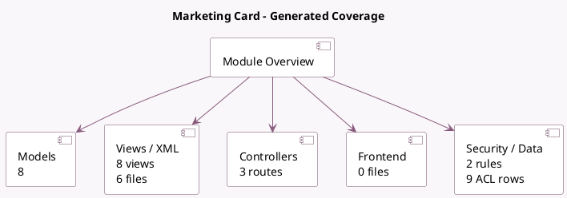

<!-- GENERATED:MODULE -->
---
tags: [odoo, community, module]
---

# Marketing Card

- Scope: Community Addons
- Source: odoo/addons/marketing_card
- Dependencies: [[docs/Community Addons/link_tracker/link_tracker|link_tracker]], [[docs/Community Addons/mass_mailing/mass_mailing|mass_mailing]], [[docs/Community Addons/website/website|website]]

## Summary

Generate dynamic shareable cards

## Generated coverage

- Models: 8
- XML files with UI/data artifacts: 6
- Views: 8
- Actions: 3
- Menus: 4
- Rules (ir.rule): 2
- Access CSV entries: 9
- Controller units: 1
- Frontend asset files: 0

## Module map

## Detail notes

- Models: [[docs/Community Addons/marketing_card/Models|Models]] (8)
- Views and XML: [[docs/Community Addons/marketing_card/Views|Views]] (6 files)
- Controllers: [[docs/Community Addons/marketing_card/Controllers|Controllers]] (1)

## Key models

- `card.campaign`
- `card.campaign.tag`
- `card.card`
- `card.template`
- `ir.model`
- `mail.compose.message`
- `mailing.mailing`
- `utm.source`

## Navigation

- [[../Community Addons/Community Addons|Back to scope]]
- [[../../docs/docs|Back to docs]]

<!-- GENERATED:MODULE -->

