<!-- GENERATED:MODEL -->
---
tags: [odoo, community, generated, model]
---

# mail.blacklist

- Module: [[docs/Community Addons/mass_mailing/mass_mailing|mass_mailing]]
- Scope: Community Addons
- Defined in module: extension only
- Source files: `models/mail_blacklist.py`
- Python classes: `MailBlacklist`

## Field footprint

- Detected fields: 1
- Field types: `Many2one` x 1
- Relation fields: 1

## Sample fields

- `opt_out_reason_id`: `Many2one` (comodel `mailing.subscription.optout`)

## Method hints

- Detected methods: 1
- Action methods: none
- Compute methods: none
- Onchange methods: none

## Direct relation diagram

```plantuml
@startuml
!define ODOO_COLOR_PRIMARY #714B67
!define ODOO_COLOR_ACCENT #875A7B
!define ODOO_COLOR_BG #FAF7FA

skinparam backgroundColor ODOO_COLOR_BG
skinparam defaultTextAlignment left
skinparam ArrowColor ODOO_COLOR_ACCENT
skinparam ClassBackgroundColor white
skinparam ClassBorderColor ODOO_COLOR_PRIMARY
skinparam ComponentBackgroundColor white
skinparam ComponentBorderColor ODOO_COLOR_PRIMARY
skinparam NoteBackgroundColor #FFF8FF
skinparam NoteBorderColor ODOO_COLOR_ACCENT
skinparam SequenceLifeLineBorderColor ODOO_COLOR_ACCENT
skinparam SequenceLifeLineBackgroundColor #FFFFFF
skinparam SequenceParticipantBorderColor ODOO_COLOR_PRIMARY
skinparam SequenceParticipantBackgroundColor #FFFFFF
skinparam sequence {
  ArrowColor ODOO_COLOR_ACCENT
  ActorBorderColor ODOO_COLOR_PRIMARY
}
title mail.blacklist - Direct Relations
class "mail.blacklist" as mail_blacklist
class "mailing.subscription.optout" as mailing_subscription_optout
mail_blacklist --> mailing_subscription_optout : opt_out_reason_id
@enduml
```

## Navigation

- **Parent:** [[docs/Community Addons/mass_mailing/Models]]

<!-- GENERATED:MODEL -->
