<!-- GENERATED:MODEL -->
---
tags: [odoo, community, generated, model]
---

# mail.compose.message

- Module: [[docs/Community Addons/mass_mailing/mass_mailing|mass_mailing]]
- Scope: Community Addons
- Defined in module: extension only
- Source files: `wizard/mail_compose_message.py`
- Python classes: `MailComposeMessage`

## Field footprint

- Detected fields: 4
- Field types: `Char` x 1, `Many2many` x 1, `Many2one` x 2
- Relation fields: 3

## Sample fields

- `campaign_id`: `Many2one` (comodel `utm.campaign`)
- `mailing_list_ids`: `Many2many` (comodel `mailing.list`)
- `mass_mailing_id`: `Many2one` (comodel `mailing.mailing`)
- `mass_mailing_name`: `Char`

## Method hints

- Detected methods: 10
- Action methods: none
- Compute methods: none
- Onchange methods: none

## Direct relation diagram

```plantuml
@startuml
!define ODOO_COLOR_PRIMARY #714B67
!define ODOO_COLOR_ACCENT #875A7B
!define ODOO_COLOR_BG #FAF7FA

skinparam backgroundColor ODOO_COLOR_BG
skinparam defaultTextAlignment left
skinparam ArrowColor ODOO_COLOR_ACCENT
skinparam ClassBackgroundColor white
skinparam ClassBorderColor ODOO_COLOR_PRIMARY
skinparam ComponentBackgroundColor white
skinparam ComponentBorderColor ODOO_COLOR_PRIMARY
skinparam NoteBackgroundColor #FFF8FF
skinparam NoteBorderColor ODOO_COLOR_ACCENT
skinparam SequenceLifeLineBorderColor ODOO_COLOR_ACCENT
skinparam SequenceLifeLineBackgroundColor #FFFFFF
skinparam SequenceParticipantBorderColor ODOO_COLOR_PRIMARY
skinparam SequenceParticipantBackgroundColor #FFFFFF
skinparam sequence {
  ArrowColor ODOO_COLOR_ACCENT
  ActorBorderColor ODOO_COLOR_PRIMARY
}
title mail.compose.message - Direct Relations
class "mail.compose.message" as mail_compose_message
class "mailing.list" as mailing_list
class "mailing.mailing" as mailing_mailing
class "utm.campaign" as utm_campaign
mail_compose_message --> mailing_mailing : mass_mailing_id
mail_compose_message --> utm_campaign : campaign_id
mail_compose_message .. mailing_list : mailing_list_ids
@enduml
```

## Navigation

- **Parent:** [[docs/Community Addons/mass_mailing/Models]]

<!-- GENERATED:MODEL -->
