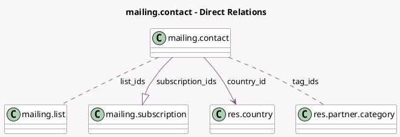

<!-- GENERATED:MODEL -->
---
tags: [odoo, community, generated, model]
---

# mailing.contact

- Module: [[docs/Community Addons/mass_mailing/mass_mailing|mass_mailing]]
- Scope: Community Addons
- Defined in module: yes
- Source files: `models/mailing_contact.py`
- Python classes: `MailingContact`
- Description: Mailing Contact
- Inherits: `mail.thread.blacklist`, `properties.base.definition.mixin`

## Field footprint

- Detected fields: 10
- Field types: `Boolean` x 1, `Char` x 5, `Many2many` x 2, `Many2one` x 1, `One2many` x 1
- Relation fields: 4

## Sample fields

- `company_name`: `Char`
- `country_id`: `Many2one` (comodel `res.country`)
- `email`: `Char` (comodel `Email`)
- `first_name`: `Char` (comodel `First Name`)
- `last_name`: `Char` (comodel `Last Name`)
- `list_ids`: `Many2many` (comodel `mailing.list`)
- `name`: `Char` (comodel `Name`, compute `_compute_name`, store `True`)
- `opt_out`: `Boolean` (comodel `Opt Out`, compute `_compute_opt_out`)
- `subscription_ids`: `One2many` (comodel `mailing.subscription`)
- `tag_ids`: `Many2many` (comodel `res.partner.category`)

## Method hints

- Detected methods: 13
- Action methods: `action_add_to_mailing_list`, `action_import`
- Compute methods: `_compute_name`, `_compute_opt_out`
- Onchange methods: none

## Direct relation diagram

## Navigation

- **Parent:** [[docs/Community Addons/mass_mailing/Models]]

<!-- GENERATED:MODEL -->
