<!-- GENERATED:MODEL -->
---
tags: [odoo, community, generated, model]
---

# mailing.filter

- Module: [[docs/Community Addons/mass_mailing/mass_mailing|mass_mailing]]
- Scope: Community Addons
- Defined in module: yes
- Source files: `models/mailing_filter.py`
- Python classes: `MailingFilter`
- Description: Mailing Favorite Filters

## Field footprint

- Detected fields: 5
- Field types: `Char` x 3, `Many2one` x 2
- Relation fields: 2

## Sample fields

- `create_uid`: `Many2one` (comodel `res.users`)
- `mailing_domain`: `Char`
- `mailing_model_id`: `Many2one` (comodel `ir.model`)
- `mailing_model_name`: `Char` (related `mailing_model_id.model`)
- `name`: `Char`

## Method hints

- Detected methods: 1
- Action methods: none
- Compute methods: none
- Onchange methods: none

## Direct relation diagram

```plantuml
@startuml
!define ODOO_COLOR_PRIMARY #714B67
!define ODOO_COLOR_ACCENT #875A7B
!define ODOO_COLOR_BG #FAF7FA

skinparam backgroundColor ODOO_COLOR_BG
skinparam defaultTextAlignment left
skinparam ArrowColor ODOO_COLOR_ACCENT
skinparam ClassBackgroundColor white
skinparam ClassBorderColor ODOO_COLOR_PRIMARY
skinparam ComponentBackgroundColor white
skinparam ComponentBorderColor ODOO_COLOR_PRIMARY
skinparam NoteBackgroundColor #FFF8FF
skinparam NoteBorderColor ODOO_COLOR_ACCENT
skinparam SequenceLifeLineBorderColor ODOO_COLOR_ACCENT
skinparam SequenceLifeLineBackgroundColor #FFFFFF
skinparam SequenceParticipantBorderColor ODOO_COLOR_PRIMARY
skinparam SequenceParticipantBackgroundColor #FFFFFF
skinparam sequence {
  ArrowColor ODOO_COLOR_ACCENT
  ActorBorderColor ODOO_COLOR_PRIMARY
}
title mailing.filter - Direct Relations
class "mailing.filter" as mailing_filter
class "ir.model" as ir_model
class "res.users" as res_users
mailing_filter --> res_users : create_uid
mailing_filter --> ir_model : mailing_model_id
@enduml
```

## Navigation

- **Parent:** [[docs/Community Addons/mass_mailing/Models]]

<!-- GENERATED:MODEL -->
