<!-- GENERATED:MODEL -->
---
tags: [odoo, community, generated, model]
---

# mailing.list

- Module: [[docs/Community Addons/mass_mailing/mass_mailing|mass_mailing]]
- Scope: Community Addons
- Defined in module: yes
- Source files: `models/mailing_list.py`
- Python classes: `MailingList`
- Description: Mailing List

## Field footprint

- Detected fields: 14
- Field types: `Boolean` x 2, `Char` x 1, `Float` x 3, `Integer` x 5, `Many2many` x 2, `One2many` x 1
- Relation fields: 3

## Sample fields

- `active`: `Boolean`
- `contact_count`: `Integer` (compute `_compute_mailing_list_statistics`)
- `contact_count_blacklisted`: `Integer` (compute `_compute_mailing_list_statistics`)
- `contact_count_email`: `Integer` (compute `_compute_mailing_list_statistics`)
- `contact_count_opt_out`: `Integer` (compute `_compute_mailing_list_statistics`)
- `contact_ids`: `Many2many` (comodel `mailing.contact`)
- `contact_pct_blacklisted`: `Float` (compute `_compute_mailing_list_statistics`)
- `contact_pct_bounce`: `Float` (compute `_compute_mailing_list_statistics`)
- `contact_pct_opt_out`: `Float` (compute `_compute_mailing_list_statistics`)
- `is_public`: `Boolean`
- `mailing_count`: `Integer` (compute `_compute_mailing_count`)
- `mailing_ids`: `Many2many` (comodel `mailing.mailing`)
- `name`: `Char`
- `subscription_ids`: `One2many` (comodel `mailing.subscription`)

## Method hints

- Detected methods: 20
- Action methods: `action_merge`, `action_open_import`, `action_send_mailing`, `action_view_contacts`, `action_view_contacts_blacklisted`, `action_view_contacts_bouncing`, `action_view_contacts_email`, `action_view_contacts_opt_out`, and 1 more
- Compute methods: `_compute_display_name`, `_compute_mailing_count`, `_compute_mailing_list_statistics`
- Onchange methods: none

## Direct relation diagram

```plantuml
@startuml
!define ODOO_COLOR_PRIMARY #714B67
!define ODOO_COLOR_ACCENT #875A7B
!define ODOO_COLOR_BG #FAF7FA

skinparam backgroundColor ODOO_COLOR_BG
skinparam defaultTextAlignment left
skinparam ArrowColor ODOO_COLOR_ACCENT
skinparam ClassBackgroundColor white
skinparam ClassBorderColor ODOO_COLOR_PRIMARY
skinparam ComponentBackgroundColor white
skinparam ComponentBorderColor ODOO_COLOR_PRIMARY
skinparam NoteBackgroundColor #FFF8FF
skinparam NoteBorderColor ODOO_COLOR_ACCENT
skinparam SequenceLifeLineBorderColor ODOO_COLOR_ACCENT
skinparam SequenceLifeLineBackgroundColor #FFFFFF
skinparam SequenceParticipantBorderColor ODOO_COLOR_PRIMARY
skinparam SequenceParticipantBackgroundColor #FFFFFF
skinparam sequence {
  ArrowColor ODOO_COLOR_ACCENT
  ActorBorderColor ODOO_COLOR_PRIMARY
}
title mailing.list - Direct Relations
class "mailing.list" as mailing_list
class "mailing.contact" as mailing_contact
class "mailing.mailing" as mailing_mailing
class "mailing.subscription" as mailing_subscription
mailing_list .. mailing_contact : contact_ids
mailing_list .. mailing_mailing : mailing_ids
mailing_list --|> mailing_subscription : subscription_ids
@enduml
```

## Navigation

- **Parent:** [[docs/Community Addons/mass_mailing/Models]]

<!-- GENERATED:MODEL -->
