<!-- GENERATED:MODEL -->
---
tags: [odoo, community, generated, model]
---

# mailing.list.merge

- Module: [[docs/Community Addons/mass_mailing/mass_mailing|mass_mailing]]
- Scope: Community Addons
- Defined in module: yes
- Source files: `wizard/mailing_list_merge.py`
- Python classes: `MailingListMerge`
- Description: Merge Mass Mailing List

## Field footprint

- Detected fields: 5
- Field types: `Boolean` x 1, `Char` x 1, `Many2many` x 1, `Many2one` x 1, `Selection` x 1
- Relation fields: 2

## Sample fields

- `archive_src_lists`: `Boolean` (comodel `Archive source mailing lists`)
- `dest_list_id`: `Many2one` (comodel `mailing.list`)
- `merge_options`: `Selection`
- `new_list_name`: `Char` (comodel `New Mailing List Name`)
- `src_list_ids`: `Many2many` (comodel `mailing.list`)

## Method hints

- Detected methods: 2
- Action methods: `action_mailing_lists_merge`
- Compute methods: none
- Onchange methods: none

## Direct relation diagram

```plantuml
@startuml
!define ODOO_COLOR_PRIMARY #714B67
!define ODOO_COLOR_ACCENT #875A7B
!define ODOO_COLOR_BG #FAF7FA

skinparam backgroundColor ODOO_COLOR_BG
skinparam defaultTextAlignment left
skinparam ArrowColor ODOO_COLOR_ACCENT
skinparam ClassBackgroundColor white
skinparam ClassBorderColor ODOO_COLOR_PRIMARY
skinparam ComponentBackgroundColor white
skinparam ComponentBorderColor ODOO_COLOR_PRIMARY
skinparam NoteBackgroundColor #FFF8FF
skinparam NoteBorderColor ODOO_COLOR_ACCENT
skinparam SequenceLifeLineBorderColor ODOO_COLOR_ACCENT
skinparam SequenceLifeLineBackgroundColor #FFFFFF
skinparam SequenceParticipantBorderColor ODOO_COLOR_PRIMARY
skinparam SequenceParticipantBackgroundColor #FFFFFF
skinparam sequence {
  ArrowColor ODOO_COLOR_ACCENT
  ActorBorderColor ODOO_COLOR_PRIMARY
}
title mailing.list.merge - Direct Relations
class "mailing.list.merge" as mailing_list_merge
class "mailing.list" as mailing_list
mailing_list_merge .. mailing_list : src_list_ids
mailing_list_merge --> mailing_list : dest_list_id
@enduml
```

## Navigation

- **Parent:** [[docs/Community Addons/mass_mailing/Models]]

<!-- GENERATED:MODEL -->
