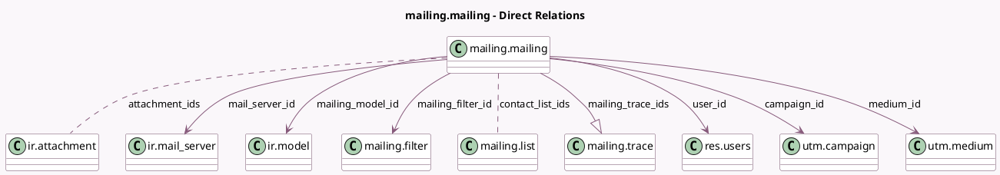

<!-- GENERATED:MODEL -->
---
tags: [odoo, community, generated, model]
---

# mailing.mailing

- Module: [[docs/Community Addons/mass_mailing/mass_mailing|mass_mailing]]
- Scope: Community Addons
- Defined in module: yes
- Source files: `models/mailing.py`
- Python classes: `MailingMailing`
- Description: Mass Mailing
- Inherits: `mail.activity.mixin`, `mail.render.mixin`, `mail.thread`, `utm.source.mixin`

## Field footprint

- Detected fields: 69
- Field types: `Boolean` x 13, `Char` x 10, `Datetime` x 6, `Float` x 5, `Html` x 3, `Integer` x 18, `Many2many` x 2, `Many2one` x 6, `One2many` x 1, `Selection` x 5
- Relation fields: 9

## Sample fields

- `ab_testing_completed`: `Boolean` (related `campaign_id.ab_testing_completed`)
- `ab_testing_description`: `Html` (comodel `A/B Testing Description`, compute `_compute_ab_testing_description`)
- `ab_testing_enabled`: `Boolean`
- `ab_testing_is_winner_mailing`: `Boolean` (comodel `Is the Winner of its Campaign`, compute `_compute_ab_testing_is_winner_mailing`)
- `ab_testing_mailings_count`: `Integer` (related `campaign_id.ab_testing_mailings_count`)
- `ab_testing_pc`: `Integer`
- `ab_testing_schedule_datetime`: `Datetime` (related `campaign_id.ab_testing_schedule_datetime`)
- `ab_testing_winner_selection`: `Selection` (related `campaign_id.ab_testing_winner_selection`)
- `active`: `Boolean`
- `attachment_ids`: `Many2many` (comodel `ir.attachment`)
- `body_arch`: `Html`
- `body_html`: `Html`
- `bounced`: `Integer` (compute `_compute_statistics`)
- `bounced_ratio`: `Float` (compute `_compute_statistics`)
- `calendar_date`: `Datetime` (comodel `Calendar Date`, compute `_compute_calendar_date`, store `True`)
- `campaign_id`: `Many2one` (comodel `utm.campaign`)
- `canceled`: `Integer` (compute `_compute_statistics`)
- `clicked`: `Integer` (compute `_compute_statistics`)
- `clicks_ratio`: `Float` (compute `_compute_clicks_ratio`)
- `color`: `Integer`

## Method hints

- Detected methods: 91
- Action methods: `action_cancel`, `action_compare_versions`, `action_duplicate`, `action_fetch_favorites`, `action_launch`, `action_put_in_queue`, `action_reload`, `action_remove_favorite`, and 19 more
- Compute methods: `_compute_ab_testing_description`, `_compute_ab_testing_is_winner_mailing`, `_compute_calendar_date`, `_compute_clicks_ratio`, `_compute_email_from`, `_compute_favorite_date`, `_compute_is_ab_test_sent`, `_compute_is_body_empty`, and 17 more
- Onchange methods: none

## Direct relation diagram

## Navigation

- **Parent:** [[docs/Community Addons/mass_mailing/Models]]

<!-- GENERATED:MODEL -->
