<!-- GENERATED:MODEL -->
---
tags: [odoo, community, generated, model]
---

# mailing.subscription

- Module: [[docs/Community Addons/mass_mailing/mass_mailing|mass_mailing]]
- Scope: Community Addons
- Defined in module: yes
- Source files: `models/mailing_subscription.py`
- Python classes: `MailingSubscription`
- Description: Mailing List Subscription

## Field footprint

- Detected fields: 7
- Field types: `Boolean` x 2, `Datetime` x 1, `Integer` x 1, `Many2one` x 3
- Relation fields: 3

## Sample fields

- `contact_id`: `Many2one` (comodel `mailing.contact`)
- `is_blacklisted`: `Boolean` (related `contact_id.is_blacklisted`, store `False`)
- `list_id`: `Many2one` (comodel `mailing.list`)
- `message_bounce`: `Integer` (related `contact_id.message_bounce`, store `False`)
- `opt_out`: `Boolean`
- `opt_out_datetime`: `Datetime` (compute `_compute_opt_out_datetime`, store `True`)
- `opt_out_reason_id`: `Many2one` (comodel `mailing.subscription.optout`)

## Method hints

- Detected methods: 4
- Action methods: none
- Compute methods: `_compute_opt_out_datetime`
- Onchange methods: none

## Direct relation diagram

```plantuml
@startuml
!define ODOO_COLOR_PRIMARY #714B67
!define ODOO_COLOR_ACCENT #875A7B
!define ODOO_COLOR_BG #FAF7FA

skinparam backgroundColor ODOO_COLOR_BG
skinparam defaultTextAlignment left
skinparam ArrowColor ODOO_COLOR_ACCENT
skinparam ClassBackgroundColor white
skinparam ClassBorderColor ODOO_COLOR_PRIMARY
skinparam ComponentBackgroundColor white
skinparam ComponentBorderColor ODOO_COLOR_PRIMARY
skinparam NoteBackgroundColor #FFF8FF
skinparam NoteBorderColor ODOO_COLOR_ACCENT
skinparam SequenceLifeLineBorderColor ODOO_COLOR_ACCENT
skinparam SequenceLifeLineBackgroundColor #FFFFFF
skinparam SequenceParticipantBorderColor ODOO_COLOR_PRIMARY
skinparam SequenceParticipantBackgroundColor #FFFFFF
skinparam sequence {
  ArrowColor ODOO_COLOR_ACCENT
  ActorBorderColor ODOO_COLOR_PRIMARY
}
title mailing.subscription - Direct Relations
class "mailing.subscription" as mailing_subscription
class "mailing.contact" as mailing_contact
class "mailing.list" as mailing_list
class "mailing.subscription.optout" as mailing_subscription_optout
mailing_subscription --> mailing_contact : contact_id
mailing_subscription --> mailing_list : list_id
mailing_subscription --> mailing_subscription_optout : opt_out_reason_id
@enduml
```

## Navigation

- **Parent:** [[docs/Community Addons/mass_mailing/Models]]

<!-- GENERATED:MODEL -->
