<!-- GENERATED:MODEL -->
---
tags: [odoo, community, generated, model]
---

# mailing.trace

- Module: [[docs/Community Addons/mass_mailing/mass_mailing|mass_mailing]]
- Scope: Community Addons
- Defined in module: yes
- Source files: `models/mailing_trace.py`
- Python classes: `MailingTrace`
- Description: Mailing Statistics

## Field footprint

- Detected fields: 20
- Field types: `Boolean` x 1, `Char` x 3, `Datetime` x 4, `Integer` x 1, `Many2one` x 5, `Many2oneReference` x 1, `One2many` x 1, `Selection` x 3, `Text` x 1
- Relation fields: 6

## Sample fields

- `campaign_id`: `Many2one` (related `mass_mailing_id.campaign_id`, store `True`)
- `email`: `Char`
- `failure_reason`: `Text` (comodel `Failure reason`)
- `failure_type`: `Selection`
- `is_test_trace`: `Boolean` (comodel `Generated for testing`)
- `links_click_datetime`: `Datetime` (comodel `Clicked On`)
- `links_click_ids`: `One2many` (comodel `link.tracker.click`)
- `mail_mail_id`: `Many2one` (comodel `mail.mail`)
- `mail_mail_id_int`: `Integer`
- `mass_mailing_id`: `Many2one` (comodel `mailing.mailing`)
- `medium_id`: `Many2one` (related `mass_mailing_id.medium_id`)
- `message_id`: `Char`
- `model`: `Char`
- `open_datetime`: `Datetime` (comodel `Opened On`)
- `reply_datetime`: `Datetime` (comodel `Replied On`)
- `res_id`: `Many2oneReference`
- `sent_datetime`: `Datetime` (comodel `Sent On`)
- `source_id`: `Many2one` (related `mass_mailing_id.source_id`)
- `trace_status`: `Selection`
- `trace_type`: `Selection`

## Method hints

- Detected methods: 10
- Action methods: `action_view_contact`
- Compute methods: `_compute_display_name`
- Onchange methods: none

## Direct relation diagram

```plantuml
@startuml
!define ODOO_COLOR_PRIMARY #714B67
!define ODOO_COLOR_ACCENT #875A7B
!define ODOO_COLOR_BG #FAF7FA

skinparam backgroundColor ODOO_COLOR_BG
skinparam defaultTextAlignment left
skinparam ArrowColor ODOO_COLOR_ACCENT
skinparam ClassBackgroundColor white
skinparam ClassBorderColor ODOO_COLOR_PRIMARY
skinparam ComponentBackgroundColor white
skinparam ComponentBorderColor ODOO_COLOR_PRIMARY
skinparam NoteBackgroundColor #FFF8FF
skinparam NoteBorderColor ODOO_COLOR_ACCENT
skinparam SequenceLifeLineBorderColor ODOO_COLOR_ACCENT
skinparam SequenceLifeLineBackgroundColor #FFFFFF
skinparam SequenceParticipantBorderColor ODOO_COLOR_PRIMARY
skinparam SequenceParticipantBackgroundColor #FFFFFF
skinparam sequence {
  ArrowColor ODOO_COLOR_ACCENT
  ActorBorderColor ODOO_COLOR_PRIMARY
}
title mailing.trace - Direct Relations
class "mailing.trace" as mailing_trace
class "link.tracker.click" as link_tracker_click
class "mail.mail" as mail_mail
class "mailing.mailing" as mailing_mailing
mailing_trace --> mail_mail : mail_mail_id
mailing_trace --> mailing_mailing : mass_mailing_id
mailing_trace --|> link_tracker_click : links_click_ids
@enduml
```

## Navigation

- **Parent:** [[docs/Community Addons/mass_mailing/Models]]

<!-- GENERATED:MODEL -->
