<!-- GENERATED:MODEL -->
---
tags: [odoo, community, generated, model]
---

# utm.campaign

- Module: [[docs/Community Addons/mass_mailing/mass_mailing|mass_mailing]]
- Scope: Community Addons
- Defined in module: extension only
- Source files: `models/utm_campaign.py`
- Python classes: `UtmCampaign`

## Field footprint

- Detected fields: 12
- Field types: `Boolean` x 2, `Datetime` x 1, `Float` x 4, `Integer` x 2, `Many2one` x 1, `One2many` x 1, `Selection` x 1
- Relation fields: 2

## Sample fields

- `ab_testing_completed`: `Boolean` (comodel `A/B Testing Campaign Finished`, compute `_compute_ab_testing_completed`, store `True`)
- `ab_testing_mailings_count`: `Integer` (comodel `A/B Test Mailings #`, compute `_compute_mailing_mail_count`)
- `ab_testing_schedule_datetime`: `Datetime` (comodel `Send Final On`)
- `ab_testing_winner_mailing_id`: `Many2one` (comodel `mailing.mailing`)
- `ab_testing_winner_selection`: `Selection`
- `bounced_ratio`: `Float` (compute `_compute_statistics`)
- `is_mailing_campaign_activated`: `Boolean` (compute `_compute_is_mailing_campaign_activated`)
- `mailing_mail_count`: `Integer` (comodel `Number of Mass Mailing`, compute `_compute_mailing_mail_count`)
- `mailing_mail_ids`: `One2many` (comodel `mailing.mailing`)
- `opened_ratio`: `Float` (compute `_compute_statistics`)
- `received_ratio`: `Float` (compute `_compute_statistics`)
- `replied_ratio`: `Float` (compute `_compute_statistics`)

## Method hints

- Detected methods: 6
- Action methods: none
- Compute methods: `_compute_ab_testing_completed`, `_compute_is_mailing_campaign_activated`, `_compute_mailing_mail_count`, `_compute_statistics`
- Onchange methods: none

## Direct relation diagram

```plantuml
@startuml
!define ODOO_COLOR_PRIMARY #714B67
!define ODOO_COLOR_ACCENT #875A7B
!define ODOO_COLOR_BG #FAF7FA

skinparam backgroundColor ODOO_COLOR_BG
skinparam defaultTextAlignment left
skinparam ArrowColor ODOO_COLOR_ACCENT
skinparam ClassBackgroundColor white
skinparam ClassBorderColor ODOO_COLOR_PRIMARY
skinparam ComponentBackgroundColor white
skinparam ComponentBorderColor ODOO_COLOR_PRIMARY
skinparam NoteBackgroundColor #FFF8FF
skinparam NoteBorderColor ODOO_COLOR_ACCENT
skinparam SequenceLifeLineBorderColor ODOO_COLOR_ACCENT
skinparam SequenceLifeLineBackgroundColor #FFFFFF
skinparam SequenceParticipantBorderColor ODOO_COLOR_PRIMARY
skinparam SequenceParticipantBackgroundColor #FFFFFF
skinparam sequence {
  ArrowColor ODOO_COLOR_ACCENT
  ActorBorderColor ODOO_COLOR_PRIMARY
}
title utm.campaign - Direct Relations
class "utm.campaign" as utm_campaign
class "mailing.mailing" as mailing_mailing
utm_campaign --|> mailing_mailing : mailing_mail_ids
utm_campaign --> mailing_mailing : ab_testing_winner_mailing_id
@enduml
```

## Navigation

- **Parent:** [[docs/Community Addons/mass_mailing/Models]]

<!-- GENERATED:MODEL -->
