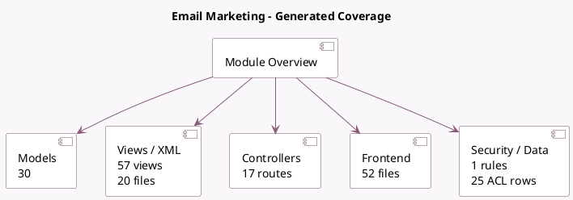

<!-- GENERATED:MODULE -->
---
tags: [odoo, community, module]
---

# Email Marketing

- Scope: Community Addons
- Source: odoo/addons/mass_mailing
- Dependencies: [[docs/Community Addons/contacts/contacts|contacts]], [[docs/Community Addons/mail/mail|mail]], [[docs/Community Addons/html_builder/html_builder|html_builder]], [[docs/Community Addons/utm/utm|utm]], [[docs/Community Addons/link_tracker/link_tracker|link_tracker]], [[docs/Community Addons/social_media/social_media|social_media]], [[docs/Community Addons/web_tour/web_tour|web_tour]], [[docs/Community Addons/digest/digest|digest]]

## Summary

Design, send and track emails

## Generated coverage

- Models: 30
- XML files with UI/data artifacts: 20
- Views: 57
- Actions: 22
- Menus: 19
- Rules (ir.rule): 1
- Access CSV entries: 25
- Controller units: 2
- Frontend asset files: 52

## Module map

## Detail notes

- Models: [[docs/Community Addons/mass_mailing/Models|Models]] (30)
- Views and XML: [[docs/Community Addons/mass_mailing/Views|Views]] (20 files)
- Controllers: [[docs/Community Addons/mass_mailing/Controllers|Controllers]] (2)
- Frontend: [[docs/Community Addons/mass_mailing/Frontend|Frontend]] (52 files)

## Key models

- `ir.http`
- `ir.mail_server`
- `ir.model`
- `link.tracker`
- `link.tracker.click`
- `mail.blacklist`
- `mail.compose.message`
- `mail.mail`
- `mail.render.mixin`
- `mail.thread`
- `mailing.contact`
- `mailing.contact.import`

## Navigation

- [[../Community Addons/Community Addons|Back to scope]]
- [[../../docs/docs|Back to docs]]

<!-- GENERATED:MODULE -->

