<!-- GENERATED:MODEL -->
---
tags: [odoo, community, generated, model]
---

# mailing.mailing

- Module: [[docs/Community Addons/mass_mailing_sms/mass_mailing_sms|mass_mailing_sms]]
- Scope: Community Addons
- Defined in module: extension only
- Source files: `models/mailing_mailing.py`
- Python classes: `MailingMailing`

## Field footprint

- Detected fields: 10
- Field types: `Boolean` x 4, `Char` x 1, `Integer` x 1, `Many2one` x 1, `Selection` x 2, `Text` x 1
- Relation fields: 1

## Sample fields

- `ab_testing_mailings_sms_count`: `Integer` (related `campaign_id.ab_testing_mailings_sms_count`)
- `ab_testing_sms_winner_selection`: `Selection` (related `campaign_id.ab_testing_sms_winner_selection`)
- `body_plaintext`: `Text` (comodel `SMS Body`, compute `_compute_body_plaintext`, store `True`)
- `mailing_type`: `Selection`
- `sms_allow_unsubscribe`: `Boolean` (comodel `Include opt-out link`)
- `sms_force_send`: `Boolean` (comodel `Send Directly`)
- `sms_has_insufficient_credit`: `Boolean` (comodel `Insufficient IAP credits`, compute `_compute_sms_has_iap_failure`)
- `sms_has_unregistered_account`: `Boolean` (comodel `Unregistered IAP account`, compute `_compute_sms_has_iap_failure`)
- `sms_subject`: `Char` (comodel `Title`, related `subject`)
- `sms_template_id`: `Many2one` (comodel `sms.template`)

## Method hints

- Detected methods: 24
- Action methods: `action_buy_sms_credits`, `action_retry_failed`, `action_retry_failed_sms`, `action_send_sms`, `action_test`
- Compute methods: `_compute_body_plaintext`, `_compute_medium_id`, `_compute_sms_has_iap_failure`
- Onchange methods: none

## Direct relation diagram

```plantuml
@startuml
!define ODOO_COLOR_PRIMARY #714B67
!define ODOO_COLOR_ACCENT #875A7B
!define ODOO_COLOR_BG #FAF7FA

skinparam backgroundColor ODOO_COLOR_BG
skinparam defaultTextAlignment left
skinparam ArrowColor ODOO_COLOR_ACCENT
skinparam ClassBackgroundColor white
skinparam ClassBorderColor ODOO_COLOR_PRIMARY
skinparam ComponentBackgroundColor white
skinparam ComponentBorderColor ODOO_COLOR_PRIMARY
skinparam NoteBackgroundColor #FFF8FF
skinparam NoteBorderColor ODOO_COLOR_ACCENT
skinparam SequenceLifeLineBorderColor ODOO_COLOR_ACCENT
skinparam SequenceLifeLineBackgroundColor #FFFFFF
skinparam SequenceParticipantBorderColor ODOO_COLOR_PRIMARY
skinparam SequenceParticipantBackgroundColor #FFFFFF
skinparam sequence {
  ArrowColor ODOO_COLOR_ACCENT
  ActorBorderColor ODOO_COLOR_PRIMARY
}
title mailing.mailing - Direct Relations
class "mailing.mailing" as mailing_mailing
class "sms.template" as sms_template
mailing_mailing --> sms_template : sms_template_id
@enduml
```

## Navigation

- **Parent:** [[docs/Community Addons/mass_mailing_sms/Models]]

<!-- GENERATED:MODEL -->
