<!-- GENERATED:MODEL -->
---
tags: [odoo, community, generated, model]
---

# sms.composer

- Module: [[docs/Community Addons/mass_mailing_sms/mass_mailing_sms|mass_mailing_sms]]
- Scope: Community Addons
- Defined in module: extension only
- Source files: `wizard/sms_composer.py`
- Python classes: `SmsComposer`

## Field footprint

- Detected fields: 3
- Field types: `Boolean` x 1, `Many2one` x 2
- Relation fields: 2

## Sample fields

- `mailing_id`: `Many2one` (comodel `mailing.mailing`)
- `mass_sms_allow_unsubscribe`: `Boolean` (comodel `Include opt-out link`)
- `utm_campaign_id`: `Many2one` (comodel `utm.campaign`)

## Method hints

- Detected methods: 10
- Action methods: none
- Compute methods: none
- Onchange methods: none

## Direct relation diagram

```plantuml
@startuml
!define ODOO_COLOR_PRIMARY #714B67
!define ODOO_COLOR_ACCENT #875A7B
!define ODOO_COLOR_BG #FAF7FA

skinparam backgroundColor ODOO_COLOR_BG
skinparam defaultTextAlignment left
skinparam ArrowColor ODOO_COLOR_ACCENT
skinparam ClassBackgroundColor white
skinparam ClassBorderColor ODOO_COLOR_PRIMARY
skinparam ComponentBackgroundColor white
skinparam ComponentBorderColor ODOO_COLOR_PRIMARY
skinparam NoteBackgroundColor #FFF8FF
skinparam NoteBorderColor ODOO_COLOR_ACCENT
skinparam SequenceLifeLineBorderColor ODOO_COLOR_ACCENT
skinparam SequenceLifeLineBackgroundColor #FFFFFF
skinparam SequenceParticipantBorderColor ODOO_COLOR_PRIMARY
skinparam SequenceParticipantBackgroundColor #FFFFFF
skinparam sequence {
  ArrowColor ODOO_COLOR_ACCENT
  ActorBorderColor ODOO_COLOR_PRIMARY
}
title sms.composer - Direct Relations
class "sms.composer" as sms_composer
class "mailing.mailing" as mailing_mailing
class "utm.campaign" as utm_campaign
sms_composer --> mailing_mailing : mailing_id
sms_composer --> utm_campaign : utm_campaign_id
@enduml
```

## Navigation

- **Parent:** [[docs/Community Addons/mass_mailing_sms/Models]]

<!-- GENERATED:MODEL -->
